# 3. Default Program Download

## 3.1 Default Program Download Instruction 

The firmware program is not flashed by default, which includes basic game functions such as "**knob control**" and "**APP control**".

### 3.1.1 Getting Ready 

[Default Program](../_static/source_code/Default_Program.zip)

Follow the instructions in "[**2.Set Arduino Environment/2.2 Arduino IDE Instruction**](https://docs.hiwonder.com/projects/miniArm/en/latest/docs/2.Set_Arduino_Environment.html#arduino-ide-instruction)" to import the .zip library file in the same directory into the Arduino IDE. If the FastLED-master.zip library file has already been imported before, you can skip this step. 

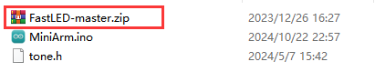

### 3.1.2 Program  Download

[Default Program](../_static/source_code/Default_Program.zip)

:::{Note}

- Remove the Bluetooth module before downloading the program. Or the program will fail to download because of the serial port conflict. 

- Please switch the battery box to the **'OFF'** when connecting the Type-B download cable. This action prevents the download cable from accidentally touching the power pins of the expansion board, which may cause a short circuit. 

:::

(1) Locate and open **"MiniArm/MiniArm.ino"** program file in the same directory of this section.

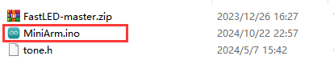

(2) Connect Arduino to the computer with the UNO data cable (Type-B) .

(3) Click **"Select Board"**, and the software will automatically detect the current Arduino serial port. Next, click to connect.

(3) Click  to download the program into Arduino. Then just wait for it to complete.

### 3.1.3 Program Outcome 

(1) When powered on, the robotic arm will return to the neutral position, and the RGB light on the expansion board will turn white. This is the neutral position program.

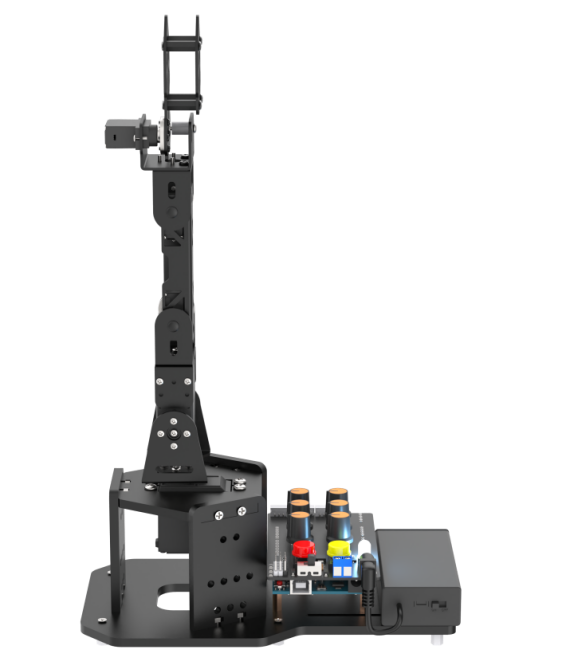

(2) Simultaneously press two buttons for one second. When the RGB light turns green, the neutral position function will be unlocked, and the knob control mode will be activated.

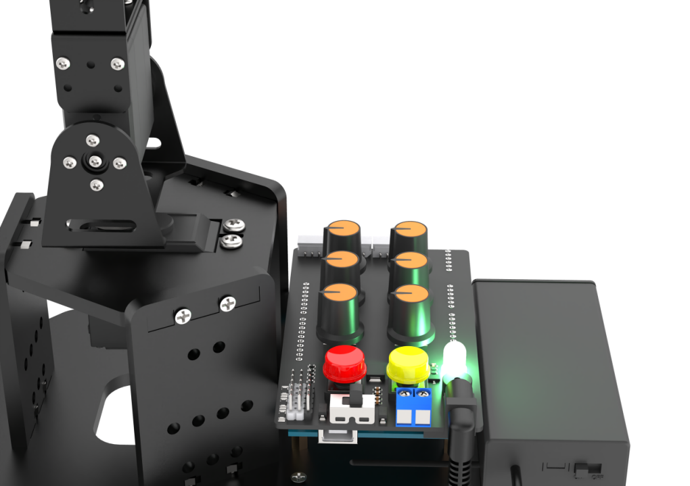

(3) Pressing K1 will first clear the previous action group and enter the action group editing mode. Then, use the knob to control the posture of the robotic arm, and press K1 to record the current posture into the action group. Press K1 to exit the action group editing mode and save the edited action group to Flash. Next, simply press K2 to execute the action group.

(4) Upon inserting the Bluetooth module and connecting to the app, the Bluetooth control game will be activated.

## 3.2 Deviation Adjustment

During miniArm assembly, there are several situations need to have deviation adjustment. For example, servo spindle shifted due to robotic arm fell, replace servo or other operations. Deviation can be categorized into small deviation and large deviation. Adjustment methods differ in different situation.

### 3.2.1 Getting Ready

Turn the switch of battery box and expansion board to **"ON"**. The RGB light up white and the robotic arm returns to the initial position.

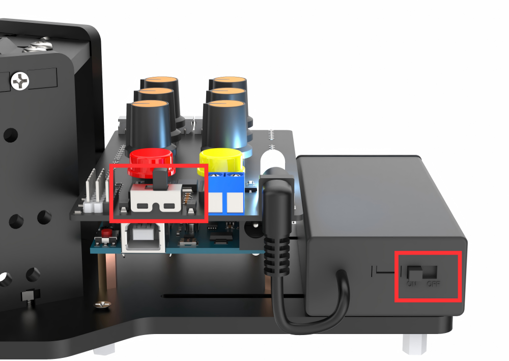

### 3.2.2 Deviation Estimation

(1) When the robotic arm is in the initial position, spindle screws of servo No.2-4 are in a straight line as pictured. The straight line is replaced by center line below.

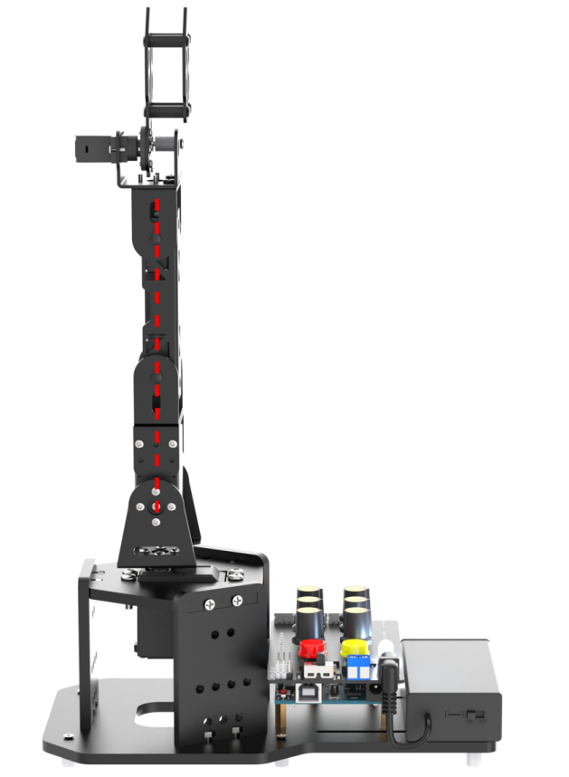

(2) You can skip this section if there is no need for deviation adjustment. The following two pictures represent the robotic arm does not need to be adjusted. As shown on the left, the grooved horizontal line of the U-shaped of servo No.5 is parallel to the horizontal line of the front square board. As shown on the right, the robotic claw of servo No.1 is just closed, and three screws on the right side are in a straight line.

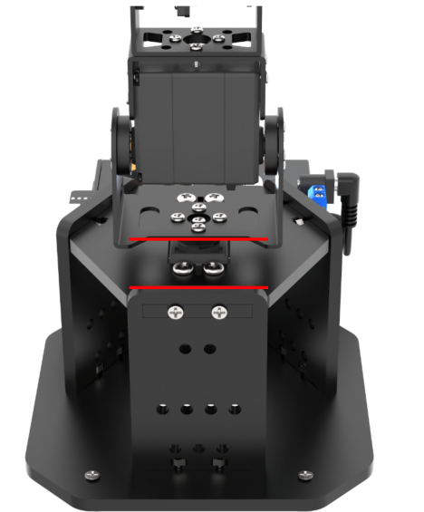

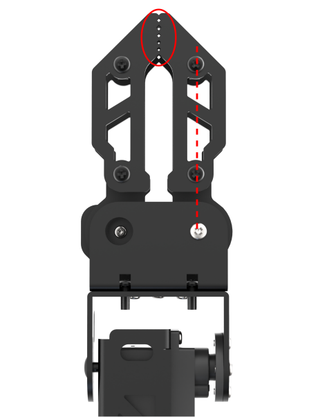

(3) If the angle between the servo and center line is less than 13°, you can adjust it through "**[3.2.3 Small Deviation Adjustment](#anchor_3_2_3)**". As pictured, taking servo No.2 as an example to show deviation situation.

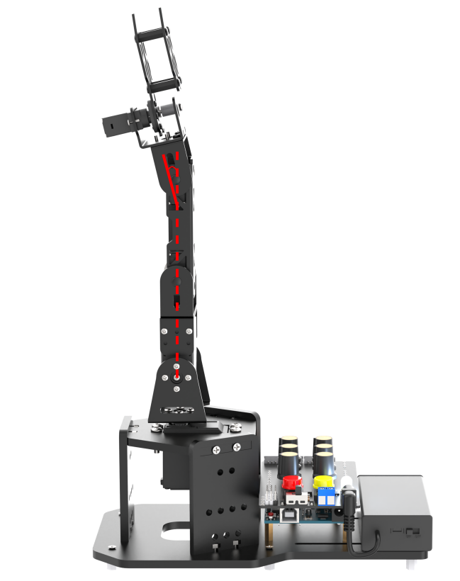

(4) If the angle between servo and center line is greater than 13°, you can adjust it through "**[3.2.4 Large Deviation Adjustment](#anchor_3_2_4)**". As pictured, taking servo No.4 as an example to show deviation situation.

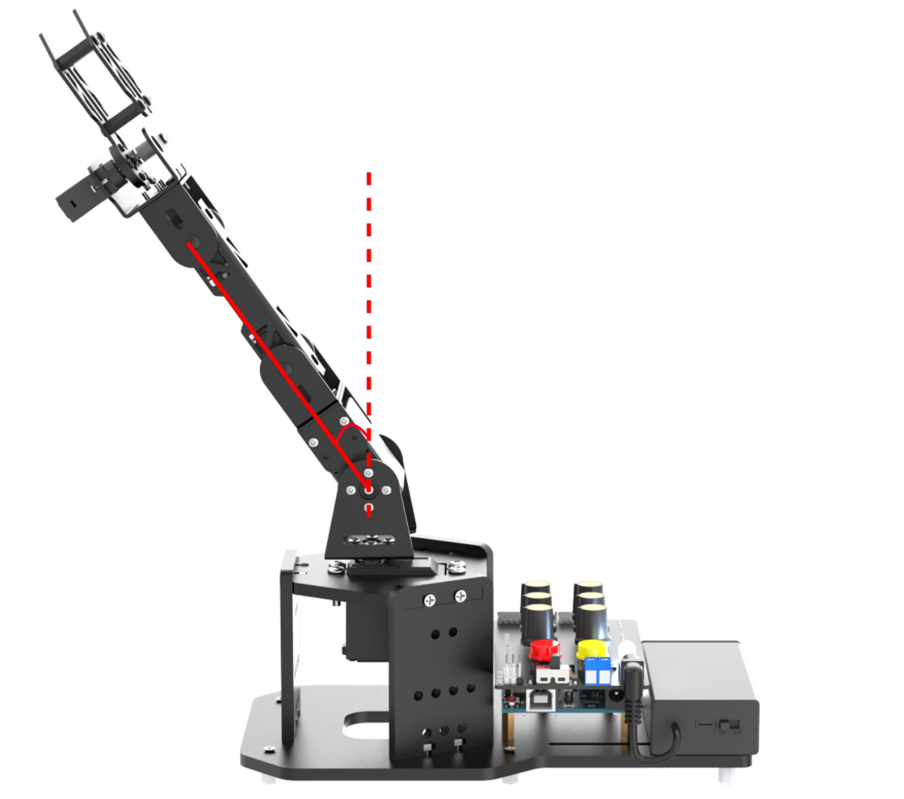

### 3.2.3 Small Deviation Adjustment

Small deviation could be adjusted by rotating knobs. The corresponding relationship between the knobs and servo is as follows:

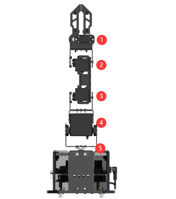

<table  class="docutils-nobg"  border="1">
  <thead>
    <tr>
      <th align="center">Knob</th>
      <th align="center">Servo</th>
      <th align="left">Control Instruction (robotic arm)</th>
    </tr>
  </thead>
  <tbody>
    <tr>
      <td align="center">S1</td>
      <td align="center">Servo No.1 (claw)</td>
      <td>Knob controls the opening and closing of the claw</td>
    </tr>
    <tr>
      <td align="center">S2</td>
      <td align="center">Servo No.2 (wrist joint)</td>
      <td rowspan="3">Knob controls the rotation of each joint servo</td>
    </tr>
    <tr>
      <td align="center">S3</td>
      <td align="center">Servo No.3 (forearm)</td>
    </tr>
    <tr>
      <td align="center">S4</td>
      <td align="center">Servo No.4 (arm)</td>
    </tr>
    <tr>
      <td align="center">S5</td>
      <td align="center">Servo No.5 (pan-tilt)</td>
      <td>Knob controls pan-tilt rotation</td>
    </tr>
  </tbody>
</table>

(1) Power on the robotic arm, long press the K1 button on the expansion board for one second. Release it when the RGB light turns green, then enter the deviation adjustment mode. Note: when adjusting deviation, the servo will be set to the current position of the knob firstly.

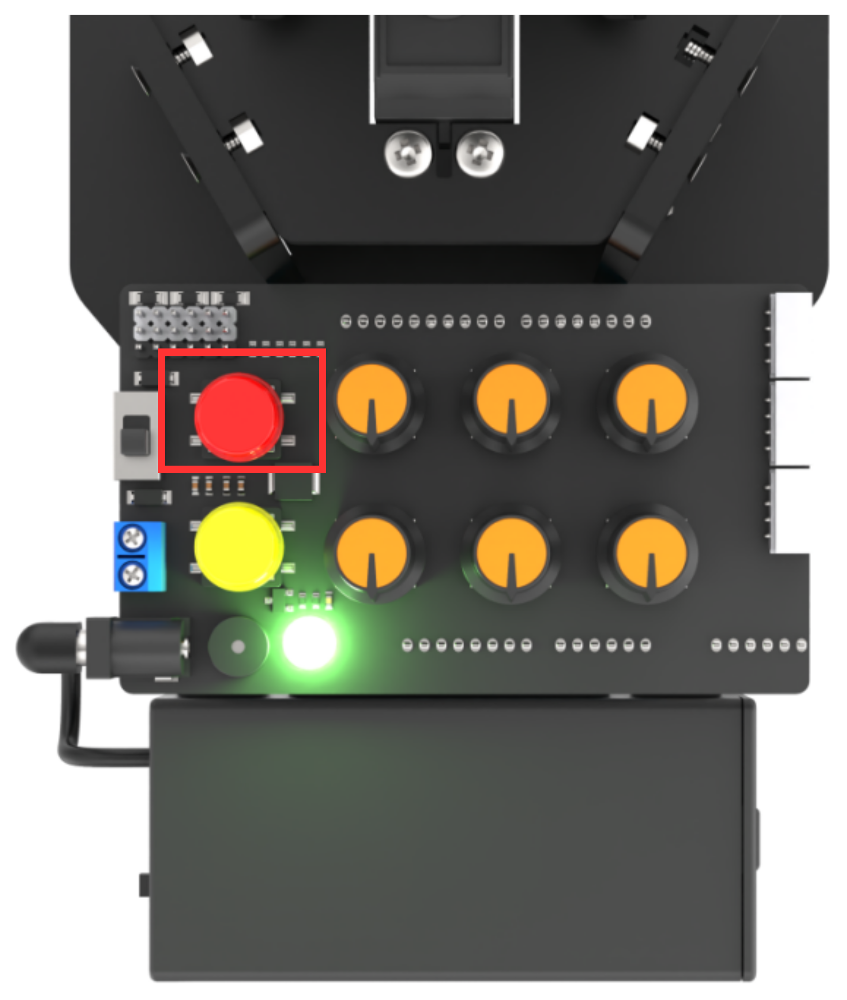

(2) Next, rotate knobs to return the robotic arm to the initial position.

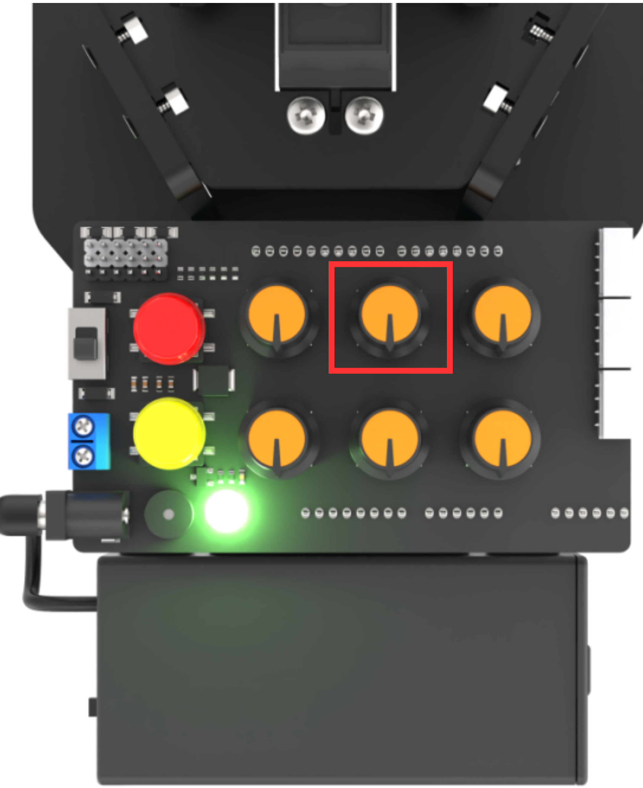

(3) After finishing adjustment, long press K2 button for one second. Release it when the RGB light up white. At this time, the servo deviation is preserved and the neutral mode will be exited.

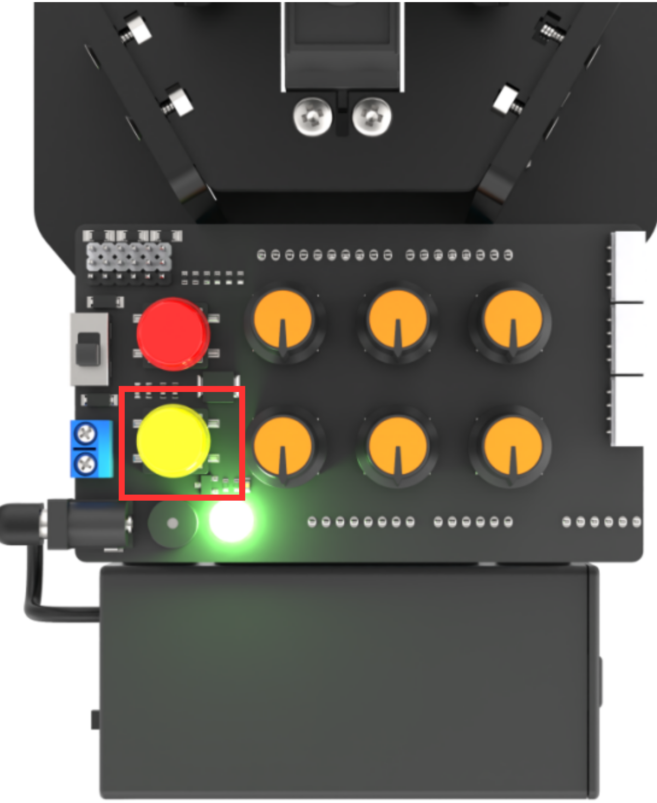

### 3.2.4 Large Deviation Adjustment

For large deviation adjustment, you need to remove the servo from the U-shaped bracket and reinstall it after returning to the initial position. Then repeat the steps for adjusting small deviation.

(1) After powering on, the robotic arm returns to the initial position. At this time, it can be found that the servo No.4 has obvious deviation. And the deviation angle is greater than 13°.

(2) Power off the robotic arm. The following steps involve disassembly. Do not perform it while powering on.

(3) Remove the screws on the U-shaped bracket of servo No.4.

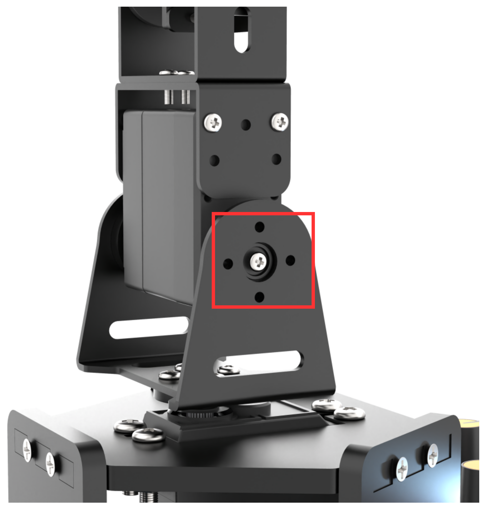

(4) Remove the robotic arm, hold it in your hand and power it on. The servo will return to initial position at this time. Then check if the holes on the main servo disk aligned in a straight line with the spindle screw.

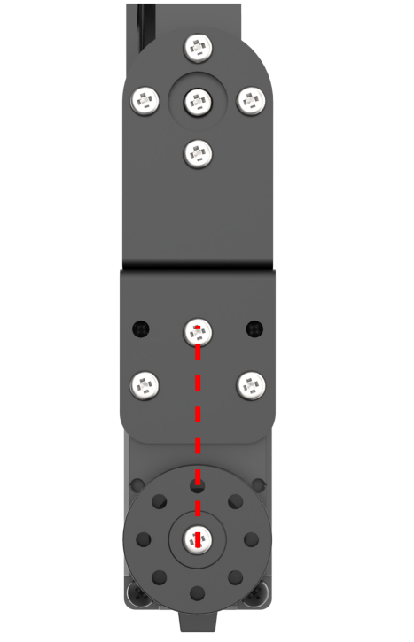

(5) If it is, install the robotic arm vertically on the U-shaped bracket. Note: servo No.1 facing forward when installed.

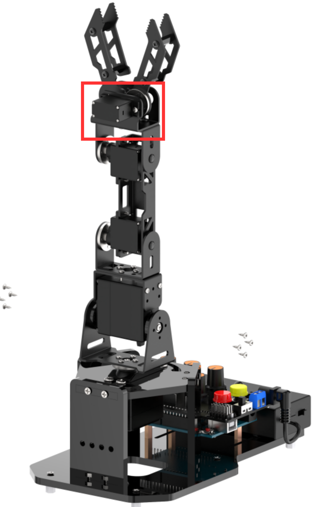

(6\) If it is not, remove the spindle screws on the main servo disk and install them until they are in a straight line. Then screw on the spindle screws again and refer to step 6 for installation.

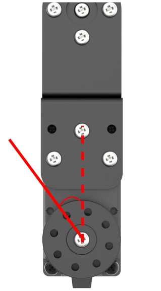

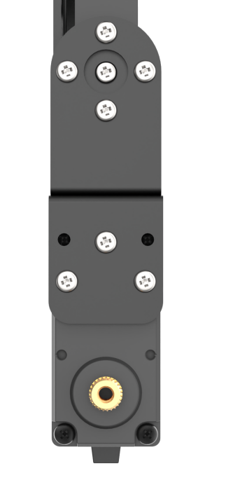

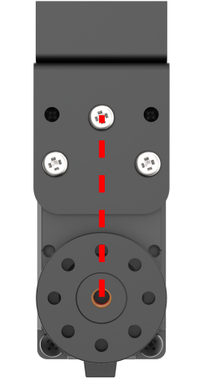

  

(7) After finishing installation, adjust small deviation based on "[3.2.3 Small Deviation Adjustment](#anchor_3_2_3)".