# 4. Konb Control

## 4.1 Getting Ready

(1) Switch the battery box and the expansion board to **"ON"**.

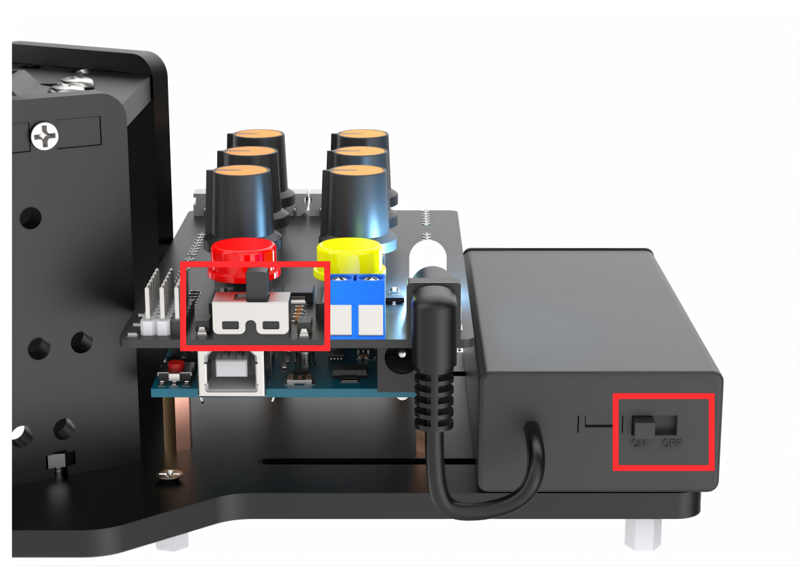

(2) At this time, the RGB light on the expansion board lights up white, and the robotic arm returns to the neutral position.

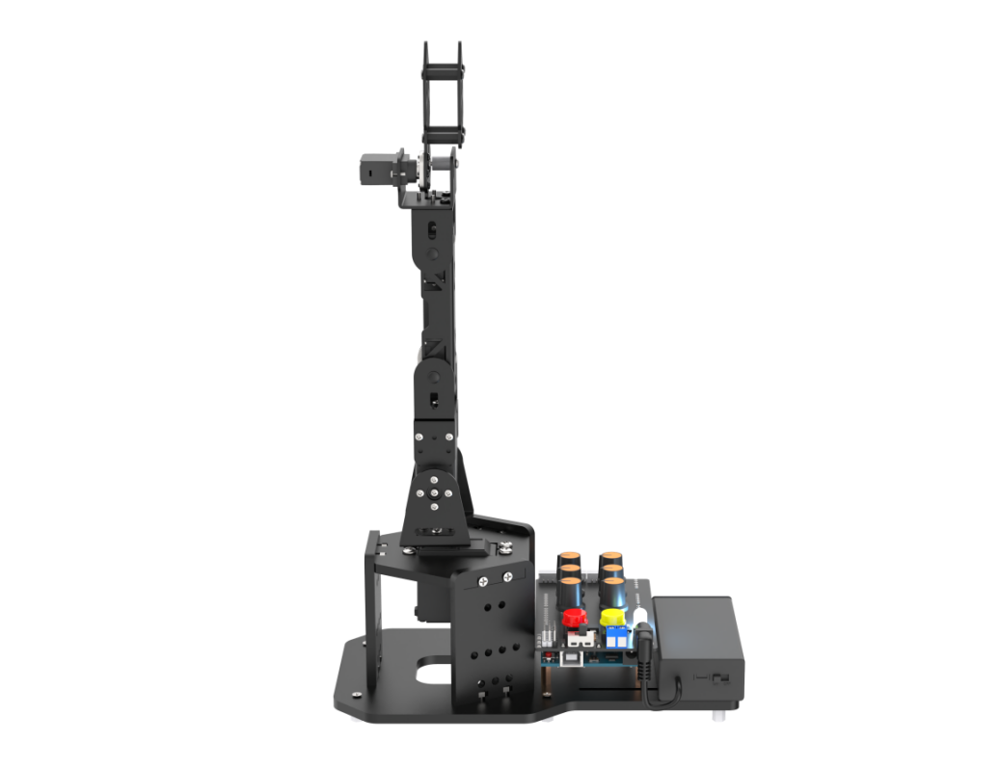

(3) Simultaneously Press K1 and K2 buttons on the expansion board. Release them once the RGB light turns green to exit the neutral position mode. If the robotic arm does not exit this mode, you cannot control it by knobs or the app.

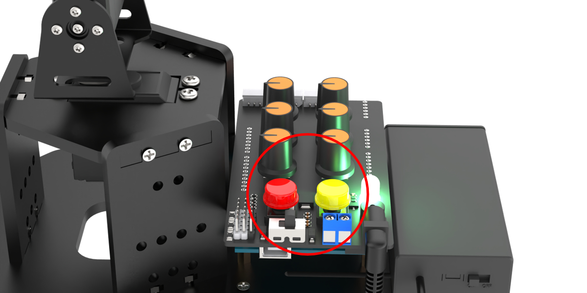

## 4.2 Operation Instruction

Two seconds after exiting the neutral position mode, the servo on the robotic arm will rotate to the same direction as the current knobs. You can turn five knobs of S1 to S5 on the expansion board to control the five servos of the robotic arm respectively.

(1) The corresponding relationship between the knobs and the servos is shown below:

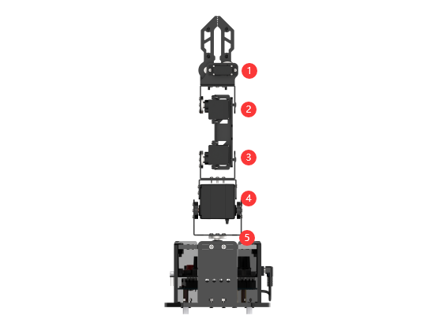

<table  class="docutils-nobg"  border="1">
  <thead>
    <tr>
      <th align="center">Knob</th>
      <th align="center">Servo</th>
      <th align="left">Control Instruction (robotic arm)</th>
    </tr>
  </thead>
  <tbody>
    <tr>
      <td align="center">S1</td>
      <td align="center">Servo No.1 (claw)</td>
      <td>Knob controls the opening and closing of the claw</td>
    </tr>
    <tr>
      <td align="center">S2</td>
      <td align="center">Servo No.2 (wrist joint)</td>
      <td rowspan="3">Knob controls the rotation of each joint servo</td>
    </tr>
    <tr>
      <td align="center">S3</td>
      <td align="center">Servo No.3 (forearm)</td>
    </tr>
    <tr>
      <td align="center">S4</td>
      <td align="center">Servo No.4 (arm)</td>
    </tr>
    <tr>
      <td align="center">S5</td>
      <td align="center">Servo No.5 (pan-tilt)</td>
      <td>Knob controls pan-tilt rotation</td>
    </tr>
  </tbody>
</table>

(2) In addition to the way mentioned above, you can also control the robotic arm through other modes.

| RGB Light |           Mode            |                       Function                        |
|:---------:|:-------------------------:|:-----------------------------------------------------:|
|   White   |   Neutral Position Mode   |       ID1-5 Servos are in the neutral position.       |
|   Green   |        Normal Mode        |                     Knob Control                      |
|    Red    | Action Group Editing Mode |                    Edit the action                    |
|  Yellow   | Action Group Running Mode | Run an offline action group edited under a red light. |
|   Blue    |         App Mode          |               Control the hand by APP.                |

For example, when you press the red button on the expansion board, the RGB light will turn red and enter into action group editing mode. After editing, the RGB light turns yellow. It indicates that the action group is executing.

When connected with the app, the RGB light will turn blue, and then enter the app control mode.

## 4.3 Edit Action Group

Edit an action to control the robotic arm to grasp the block on its left side, rotate to the right side, and release the block. Then, it returns to the neutral position.

### 4.3.1 Button and Mode Introduction

In addition to utilizing the knobs on the expansion board, editing actions also necessitate the use of buttons to achieve functionalities such as saving actions and mode switching. About the button function and mode instruction used in this game, please refer to the following table:

<table  class="docutils-nobg"  border="1">
  <thead>
    <tr>
      <th align="center">Mode</th>
      <th align="center">Button</th>
      <th align="center">Display</th>
    </tr>
  </thead>
  <tbody>
    <!-- Neutral Position Mode -->
    <tr>
      <td align="center" rowspan="1">Neutral Position Mode</td>
      <td>Automatically enter the mode after powered on, at the same time long press"<b>K1, K2</b>" to exit</td>
      <td>ID1-5 servos are at 90 °.</td>
    </tr>
    <tr>
      <td align="center" rowspan="3">Normal mode (green light is steady on)</td>
      <td>Long press the red "<b>K1</b>"</td>
      <td>Enter the editing action group mode to clear the original action group.</td>
    </tr>
    <tr>
      <td>Short press the yellow "<b>K2</b>"</td>
      <td>Enter the running action group mode to run the saved action group once.</td>
    </tr>
    <tr>
      <td>Long press the yellow "<b>K2</b>"</td>
      <td>Enter the running action group mode and loop run the saved action group.</td>
    </tr>
    <tr>
      <td align="center" rowspan="2">Editing action group mode (red light is steady on)</td>
      <td>Short press the red "<b>K1</b>"</td>
      <td>Save action.</td>
    </tr>
    <tr>
      <td>Long press the red "<b>K1</b>"</td>
      <td>Save the editing action group and exit to switch to the normal mode.</td>
    </tr>
    <tr>
      <td align="center">Running action group mode (yellow light is steady on)</td>
      <td>Short press the red "<b>K1</b>"</td>
      <td>Stop the running action group and switch to the normal mode.</td>
    </tr>
  </tbody>
</table>

### 4.3.2 Operation Steps

(1) Turn on the robotic arm by holding down the K1 and K2 buttons on the expansion board. Release once the green light comes on.

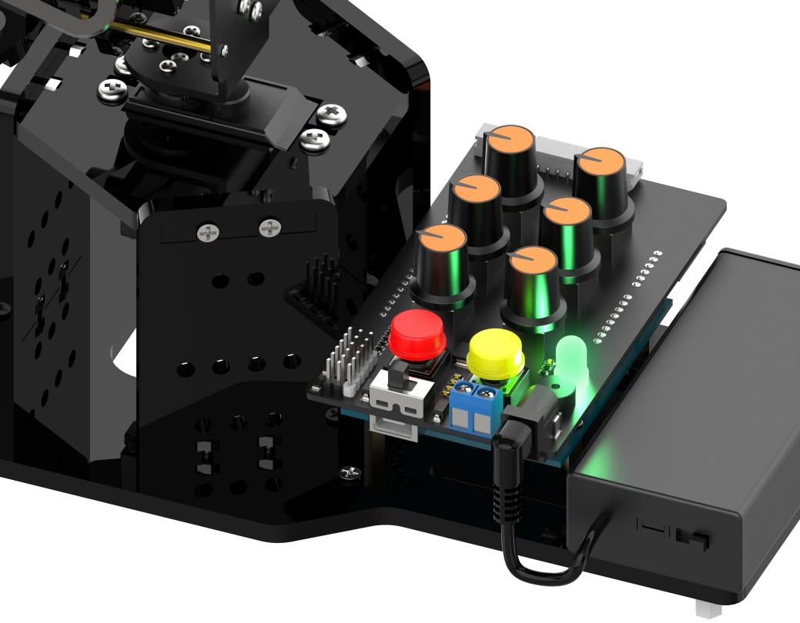

(2) After 2 seconds, the servo returns to the knob control position. Then, long-press the red button **"K1"** on the expansion board. The buzzer will emit a prompt sound, and the RGB light color will change from green to red, indicating entry into action group editing mode.

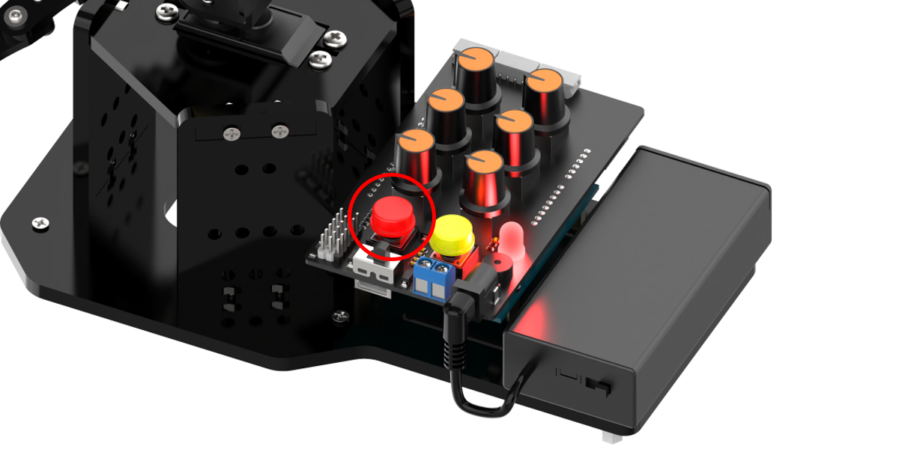

(3) Rotate the knobs of S1 to S5 to rotate the robotic arm to the left, making it be in the grasping state. Short press **"K1"** and the buzzer short sounds to save the first action.

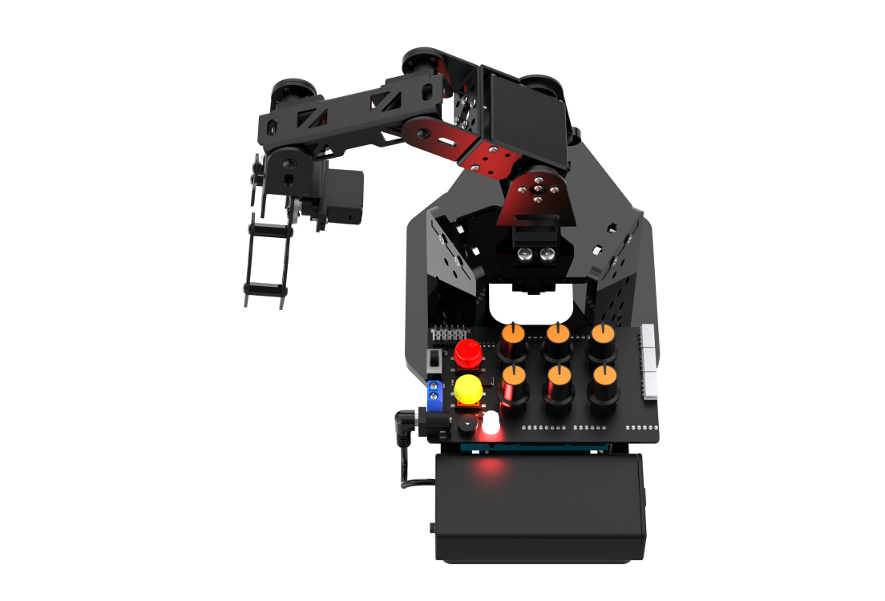

(4) Next, you can place the block under the robotic gripper. Rotate the knob S1 to control the robotic gripper to grasp the block. Short press the red button **"K1"**, and the buzzer makes a short sound to save the action.

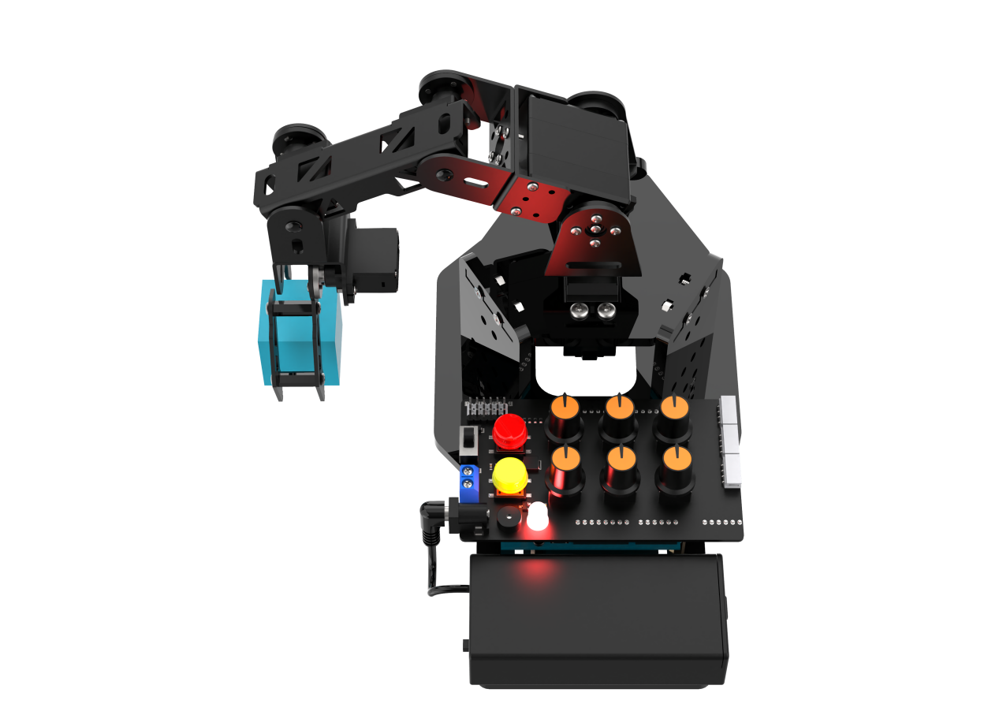

(5) Rotate the knob S4 to control the robotic arm to raise up. Short press the red button **"K1"**, and the buzzer makes a short sound to save the action.

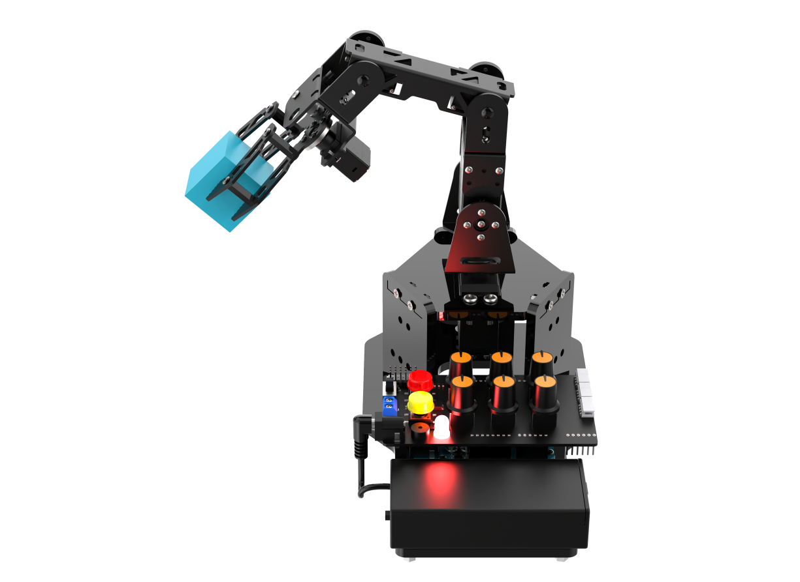

(6) Rotate the knob S5 to turn the robotic arm to the right. Short press the red button **"K1"**, and the buzzer makes a short sound to save the action.

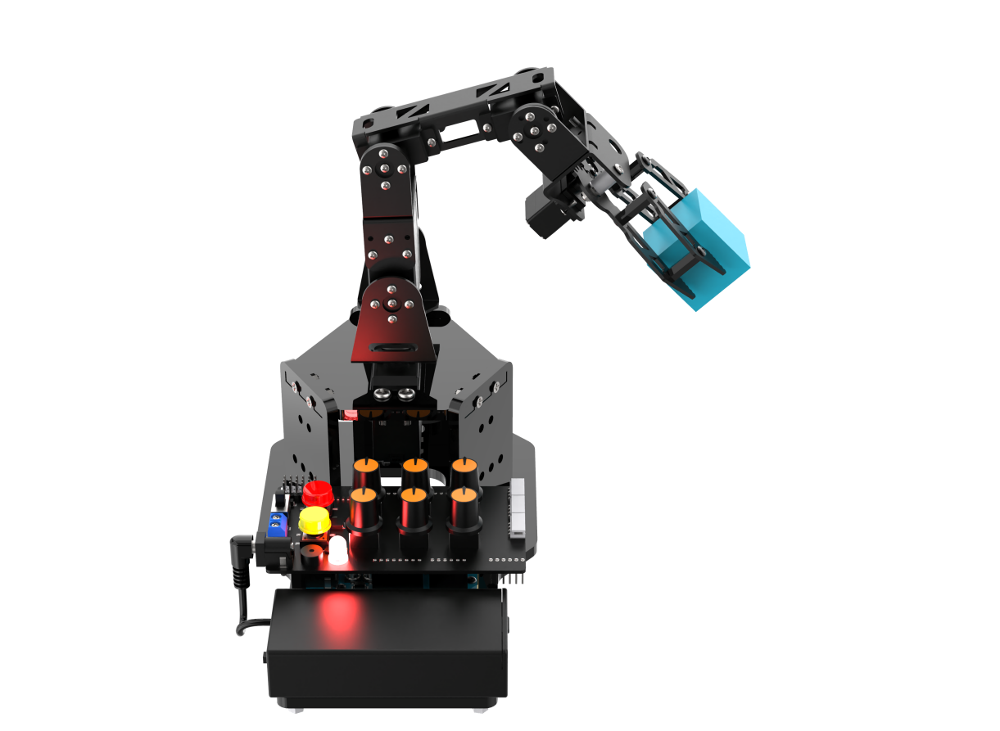

(7) Rotate the knob S4 to control the robotic arm to move down. Short press the red button **"K1"**, and the buzzer makes a short sound to save the action.

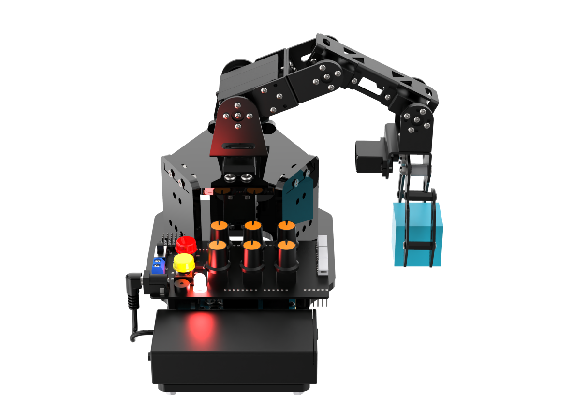

(8) Rotate the knob S1 to control the robotic arm to release the block. Short press the red button **"K1"**, and the buzzer makes a short sound to save the action.

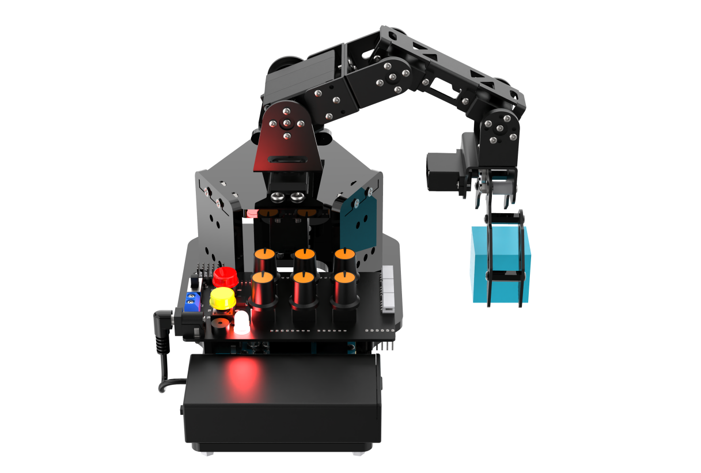

(9) Rotate the knob S4 to control the robotic arm to raise up. Short press the red button **"K1"**, and the buzzer makes a short sound to save the action.

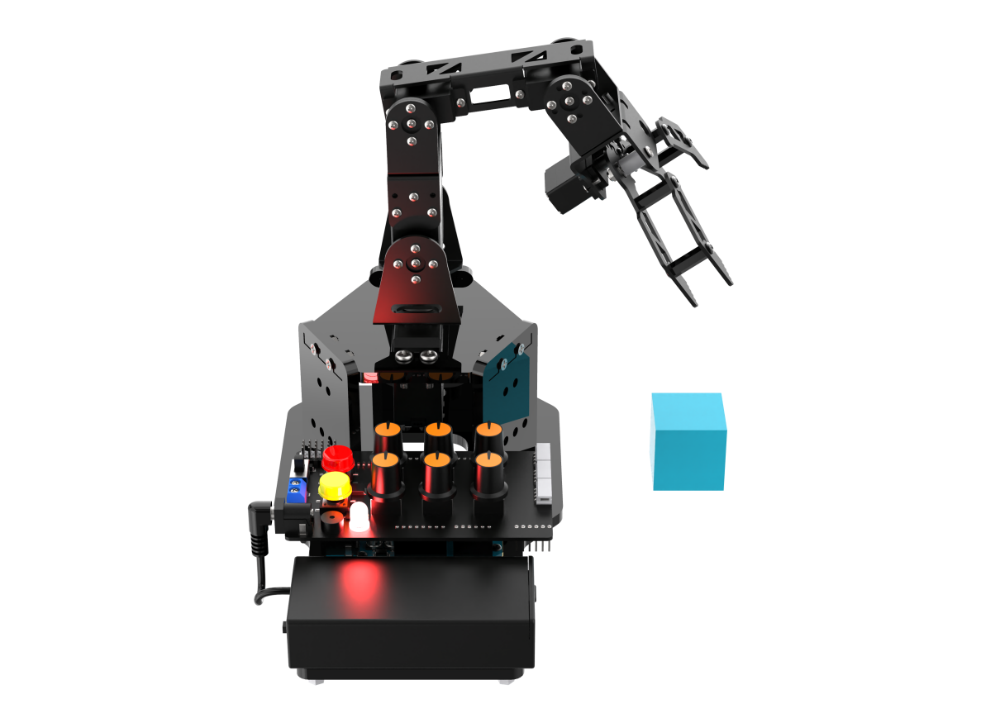

(10) Rotate the knobs S1 to S5 to return the robotic arm to the neutral position. Short press the red button **"K1"**, and the buzzer makes a short sound to save the action.

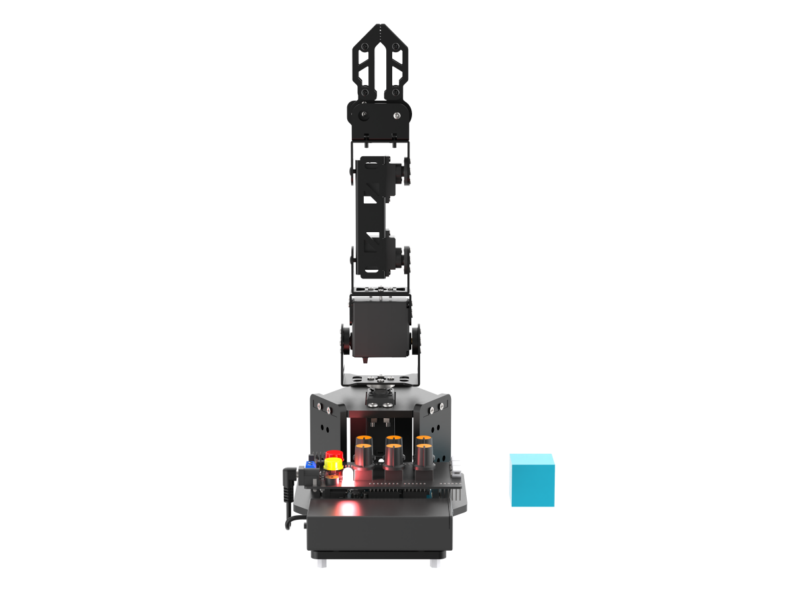

(11) Finally, long press the red button **"K1"**. The buzzer makes a long sound and the RGB turns green. The robotic arm saves the current editing action group and exits the mode.

:::{Note}

Entering the action group editing mode by long-press the red button "**K1**" will erase all previously edited action group data.

:::

### 4.3.3 Run Action Group

After editing action groups, you can execute the saved action group by pressing the yellow button **"K2"** on the expansion board. A long press will loop the action group.

:::{Note}

* Edited action group is able to be saved after power-off. Which means it can be run again at the next boot.

* To stop a running action group, you can short press the red button "**K1**" to switch the robotic arm back to normal mode.

:::