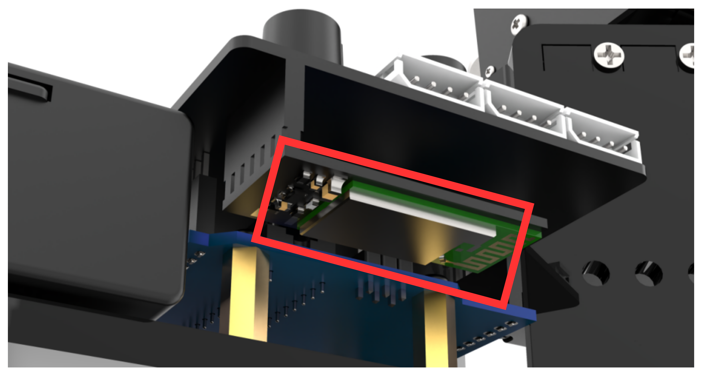
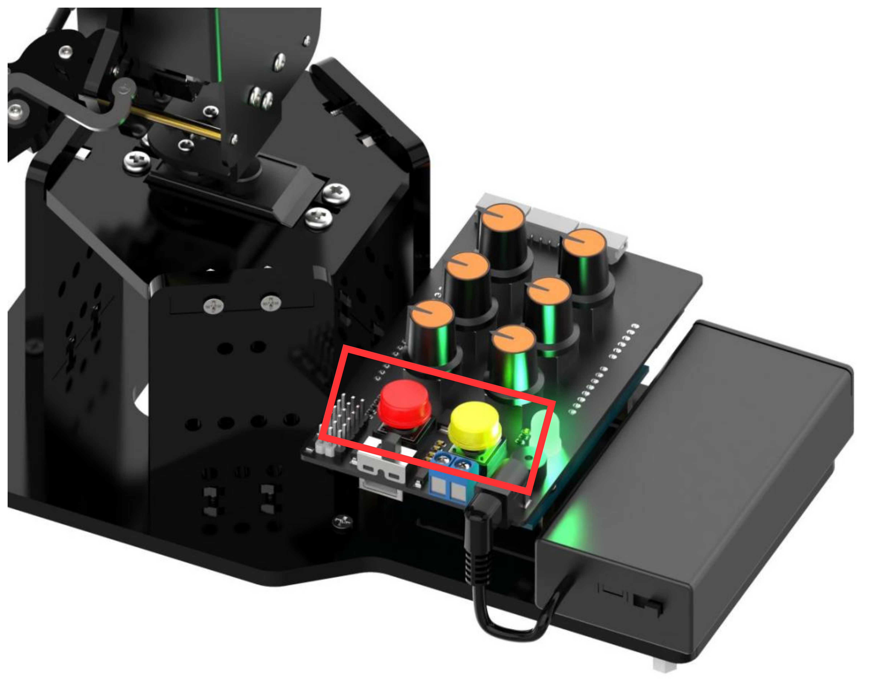
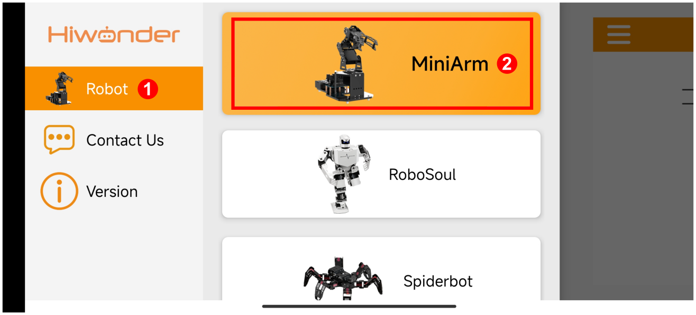
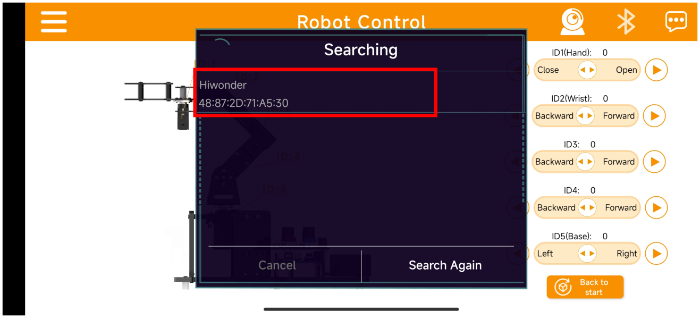
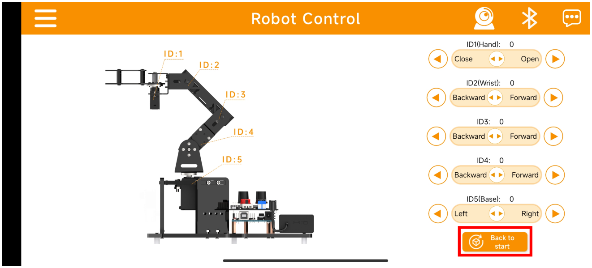
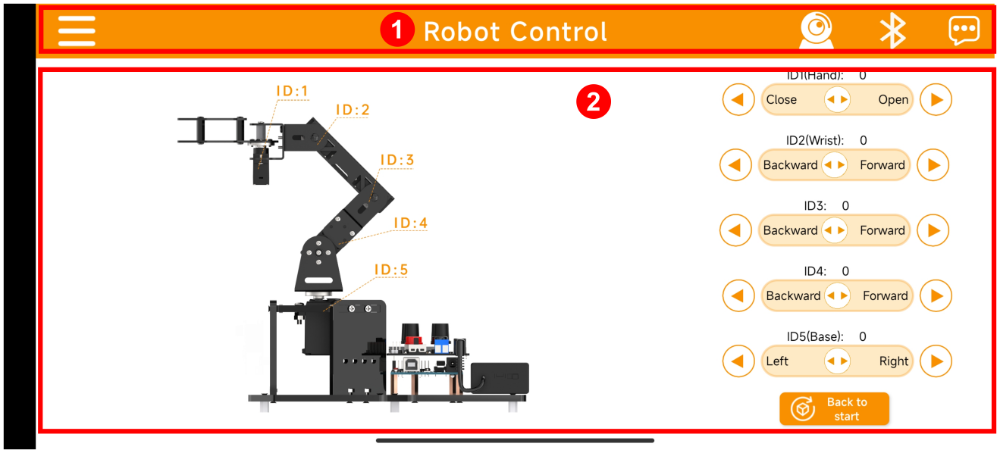
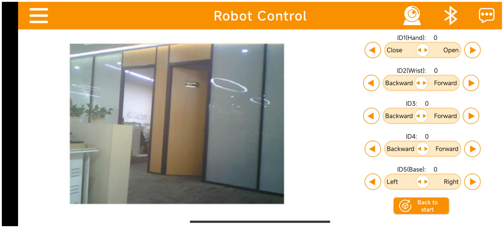

# 5. APP Control

## 5.1 APP Installation

iOS users: search [Wonderbot]() in App Store and download it.

Android users : [Wonderbot]()

## 5.2 Device Connection 

:::{Note}

* Please enable Bluetooth and location services in the phone settings before opening APP.

* Please use the Bluetooth button in the APP to pair and connect with the device. Do not pair with the key in the phone settings.

* Take Android APP as example in this lesson.

:::

**Step 1:** Make sure the Bluetooth module is installed correctly on the miniArm 6 channel knob expansion board by aligning pins one by one, as shown below:

**Step 2:** Turn on the power switches of the battery case and the expansion board. Press the K1 and K2 buttons on the expansion board at the same time, and release them until the RGB light turns to green. Then it can exit the neutral position mode. (If it does not exit, you can not control by the knob or app.)

**Step 3:** Open the APP **“Wonderbot”,** and tap on the icon  at the top left corner to select **“MiniArm”**.

**Step 4:** In game interface, tap on  at the top right corner, and find **“Hiwonder”** in Bluetooth list. Click on the link.

:::{Note}

If the **“Hiwonder”** does not appear immediately after clicking on the Bluetooth icon, you can click“Retry”to search it again.

:::

**Step 5:** After successfully connecting, the Bluetooth icon at the top right corner will switch to a steady mode. Click **“Back to start”** to return the robotic arm to the initial position.

## 5.3 Control Instruction 

### 5.3.1 Slider Control

The app has a slider control function and live camera feed function. You can control rotation angle of each servo of the robotic arm by sliding the slider.

The app interface consists of two parts as shown below:

①：Menu Bar

<table  class="docutils-nobg" style="margin:0 auto" border="1">
  <thead>
    <tr>
      <th align="center">Icon</th>
      <th align="center">Function Description</th>
    </tr>
  </thead>
  <tbody>
    <tr>
      <td align="center"></td>
      <td align="center">Return to the main interface to select robot type</td>
    </tr>
    <tr>
      <td align="center"></td>
      <td align="center">Open the live camera feed function</td>
    </tr>
    <tr>
      <td align="center"></td>
      <td align="center">Bluetooth connection</td>
    </tr>
    <tr>
      <td align="center"></td>
      <td align="center">More information</td>
    </tr>
  </tbody>
</table>

②：Control Area

<table  class="docutils-nobg" style="margin:0 auto" border="1">
  <thead>
    <tr>
      <th align="center">Control Interface</th>
      <th align="center">Servo Control Specification</th>
    </tr>
  </thead>
  <tbody>
    <tr>
      <td align="center" width="200">
        
      </td>
      <td>
        <strong>Servo No.1</strong> 
        Controls the robotic claw to open and close 
        <em>Angle range:</em> 0° to 180°
      </td>
    </tr>
    <tr>
      <td align="center" width="200">
        
      </td>
      <td>
        <strong>Servo No.2~5</strong> 
        Control the rotation of robotic arm 
        <em>Angle range:</em> 0° to 180°
      </td>
    </tr>
    <tr>
      <td align="center" width="200">
        
      </td>
      <td>
        <strong>System Reset</strong> 
        Control all the servos to return to the initial position
      </td>
    </tr>
  </tbody>
</table>

### 5.3.2 Live Camera Feed Function

:::{Note}

To achieve the live camera feed function of the miniArm, please flash the firmware into ESP32S3-Cam based on the relevant tutorial.

:::

(1) Click icon  on the menu to open live camera feed mode. The interface of this mode is as pictured:

Now you can see the real-time image transmitted by ESP32S3-Cam on the app.