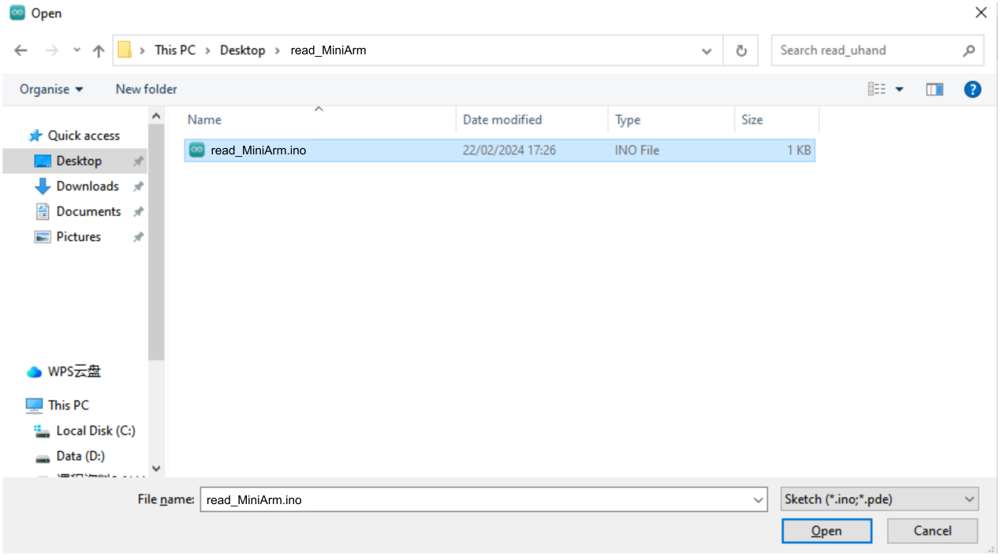
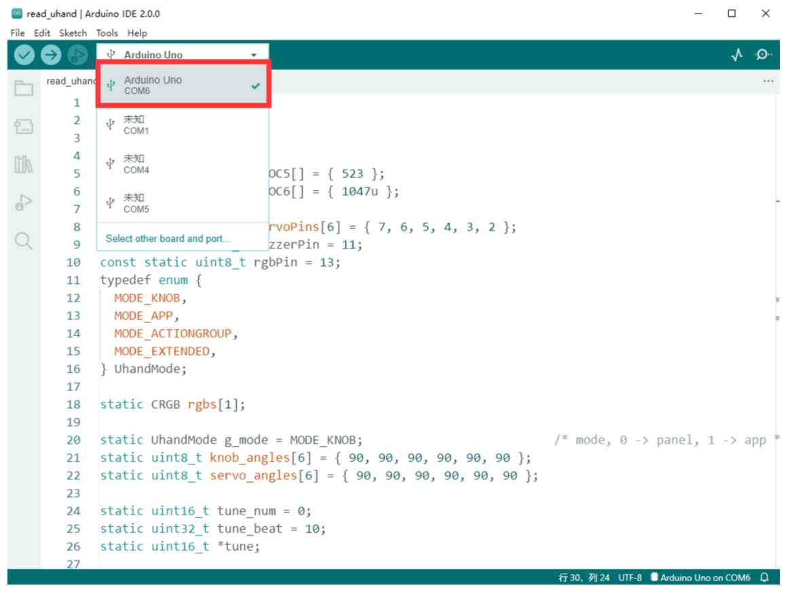
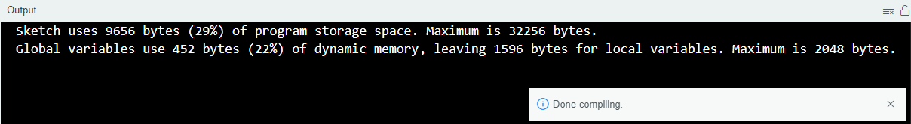
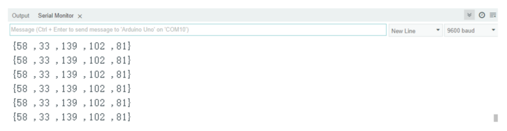
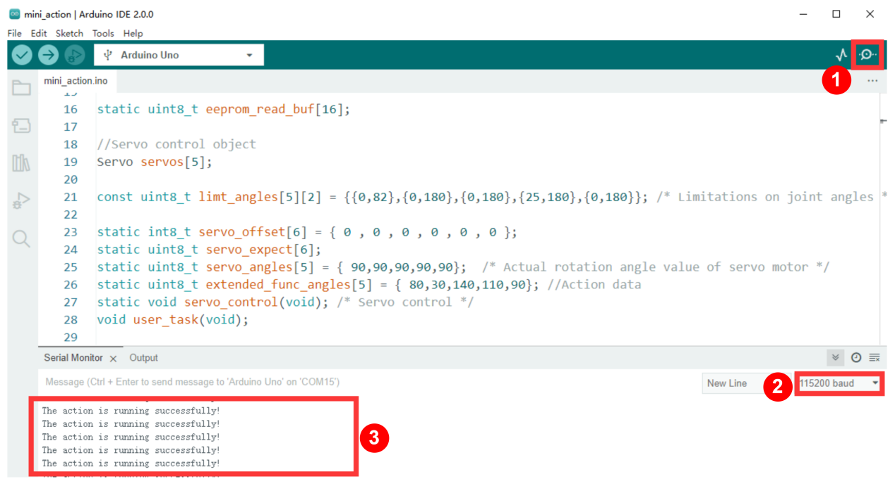
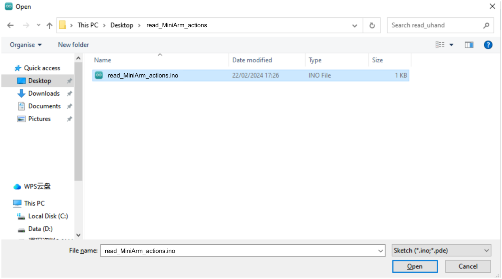
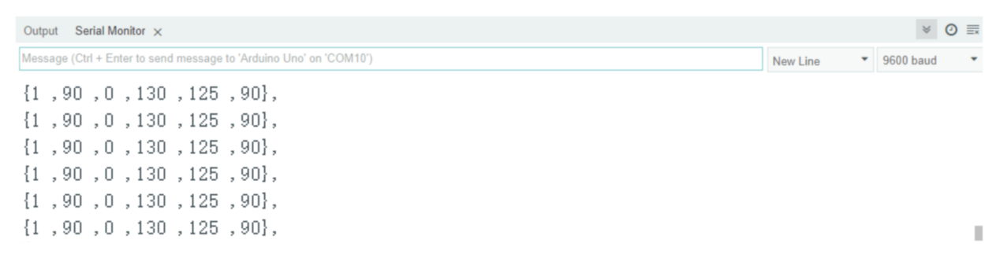
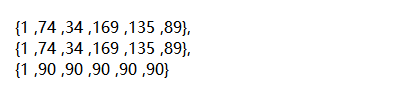
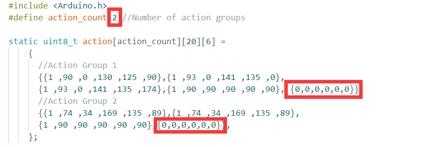
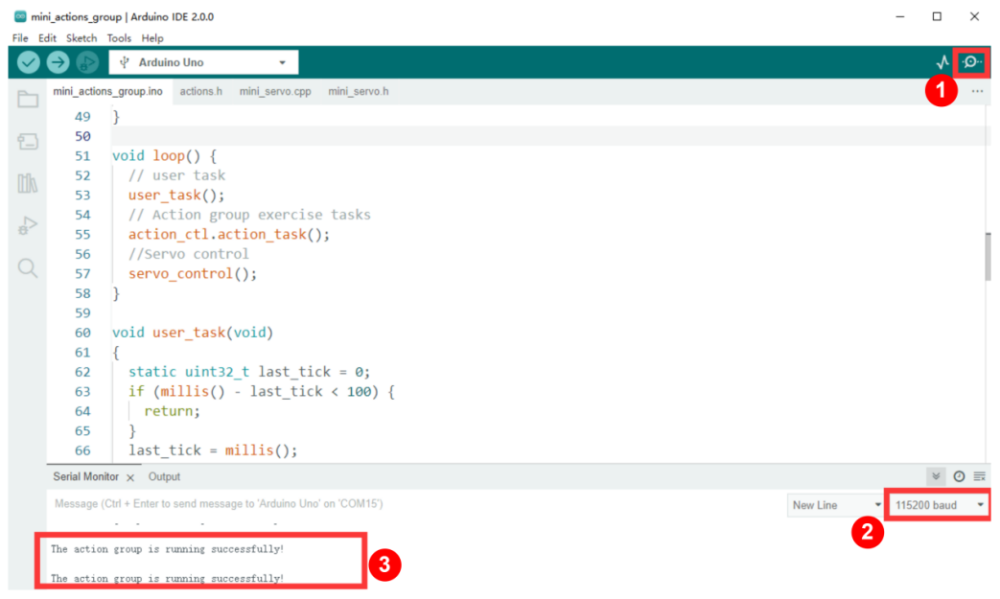

# 6. Motion Control Basic Course

## 6.1 Brief Control Course

This section aims to guide you on how to obtain the action data of miniArm via Arduino platform, as well as how to write and execute an action.

### 6.1.1 Read Action Data 

[Read Action Data Program]()

* **Program Download**

Remove the Bluetooth module before downloading the program. Or the program will fail to download because of the serial port conflict.

Please switch the battery box to **“OFF”** when connecting Type-B download cable. This action prevents the download cable from accidentally touching the power pins of the expansion board, which may cause a short circuit.

(1) Double click  to open it.


(2) Connect the Arduino to the computer with a Type-B cable.


(3) Click **“File -\> Open”**.


(4) Access **“Read Action Data Program”**. Select **“read_mini.ino”** program in **“read_mini”** folder and click “**Open”**.



(5) Locate Arduino development board in “**Select Board”**. (Take Arduino Uno as an example. COM ports are not unique, and their numbers can be checked in computer's device management. Take COM6 as an example.)



(6) After confirming that everything is correct, click  to verify the program. If the program is correct, the status area shows **“Compiling Project -&gt; Completed”** in turn. Then it displays the number of bytes used by the current project, the program storage space and etc.



(7) After successful compilation, click  to upload the program to the development board. The status area shows **“Compiling Project-&gt; Uploading-&gt; Upload successfully”** in turn. After that, the status area stops printing and uploading information.


* **Get Action Data**

(1) Please keep the Type-B connected to the computer. (Do not plug off the cable during the process to ensure communication.)

(2) Press **“Ctrl+Shift+M”** to open the serial port monitor to check real-time angle data of servos No.1 to No.5.



(3) By rotating the knobs (S1 to S5) on MiniArm, you can adjust the corresponding angles of servos. And then save the action data.

### 6.1.2 Action Running

[Action Running Program]()

* **Write Action**

(1) Open the program file **“mini_action\\ mini_action.ino”** in the same path as this section.


(2) Locate the code highlighted in the image below, and write the obtained action data into it.

{lineno-start=23}

```
static int8_t servo_offset[6] = { 0 , 0 , 0 , 0 , 0 , 0 };
static uint8_t servo_expect[6];
static uint8_t servo_angles[5] = { 90,90,90,90,90};  /* 舵机实际转动角度数值(the actual rotation angle values of the servos) */
static uint8_t extended_func_angles[5] = { 80,30,140,110,90}; //动作数据(action data)
static void servo_control(void); /* 舵机控制(servo control) */
```

In action data, the 1st to 5th bits indicate respectively the corresponding angles of No.1 to No.5 servos.

(3) Refer to “[6.1.1 Read Action Data -> Program Download]()” above to download the program **“mini_action.ino”** into Arduino UNO.

(4) After the download is complete, power the robotic arm on to run the set action.

* **Action Running Outcome**

Power the robotic arm on and keep the Type-B connected to the computer. Open the serial port monitor to select the baud rate as **“115200”**.

Once the action is completed, the serial port monitor will display **“The action is running successfully!”**, indicating successful execution of the action.



* **Action Running Program Analysis**

(1) Initialize the serial port as **“115200”**, then the servo pins. Call the error reading function  `read_servo_offset()` to read the current deviation of the robotic arm.

{lineno-start=30}

```
void setup() {
  // put your setup code here, to run once:
  Serial.begin(115200);
  // 设置串行端口读取数据的超时时间(set the timeout for serial port reading data)
  Serial.setTimeout(500);
  
  // 绑定舵机IO口(bind servo IO pin)
  for (int i = 0; i < 5; ++i) {
    servos[i].attach(servoPins[i]);
  }

  //调用偏差读取(call deviation read)
  read_servo_offset();

  delay(2000);
  Serial.println("start");
}
```

(2) In the  `user_task()` function, store the codes to be executed for users.

{lineno-start=56}

```
void user_task(void)
{
  static uint32_t last_tick = 0;
  if (millis() - last_tick < 100) {
    return;
  }
  last_tick = millis();

  Serial.println("The action is running successfully!");
}
```

(3) Next, call  `servo_control()` to control servos rotating to corresponding angles for achieving related action. Adjust the deviation of the current robotic arm before running the action.

{lineno-start=67}

```
// 舵机控制任务（不需修改）(servo control task (no need to modify))
void servo_control(void) {
  static uint32_t last_tick = 0;
  if (millis() - last_tick < 20) {
    return;
  }
  last_tick = millis();

  for (int i = 0; i < 5; ++i) {
    servo_expect[i] = extended_func_angles[i] + servo_offset[i];
    if(servo_angles[i] > servo_expect[i])
    {
      servo_angles[i] = servo_angles[i] * 0.9 + servo_expect[i] * 0.1;
      if(servo_angles[i] < servo_expect[i])
        servo_angles[i] = servo_expect[i];
    }else if(servo_angles[i] < servo_expect[i])
    {
      servo_angles[i] = servo_angles[i] * 0.9 + (servo_expect[i] * 0.1 + 1);
      if(servo_angles[i] > servo_expect[i])
        servo_angles[i] = servo_expect[i];
    }

    servo_angles[i] = servo_angles[i] < limt_angles[i][0] ? limt_angles[i][0] : servo_angles[i];
    servo_angles[i] = servo_angles[i] > limt_angles[i][1] ? limt_angles[i][1] : servo_angles[i];
    servos[i].write(i == 0 || i == 5 ? 180 - servo_angles[i] : servo_angles[i]);
  }
}
```

If modifying the rotation speed of the robotic arm’s servos, you should ensure that the sum of actual and desired values is **“1”**.

For instance, if you modify the actual value as **“0.5”**, you should change the corresponding desired value to **“0.5”**. After modifying, download the program, and you will see a significant increase in the rotation speed of the robotic arm’s servos.

## 6.2 Action Group Control Course

This section aims to guide you on how to obtain the data of miniArm’s action group via Arduino platform, as well as how to write and execute the action group.

### 6.2.1 Read Action Group 

[Read Action Data Program]()

* **Basic Program Download**

Remove the Bluetooth module before downloading the program. Or the program will fail to download because of the serial port conflict.

Please switch the battery box to **“OFF”** when connecting Type-B download cable. This action prevents the download cable from accidentally touching the power pins of the expansion board, which may cause a short circuit.

(1) Double click  to open it.


(2) Connect the Arduino to the computer with the UNO cable (Type-B).


(3) Click **“File -\> Open”**.


(4) Access **“Read Action Data Program”**. Select **“read_mini_actions.ino”** program in **“read_mini_actions”** folder and click **“Open”**.



(5) Locate Arduino development board in **“Select Board”**. (Take Arduino Uno as an example. COM ports are not unique, and their numbers can be checked in computer's device management. Take COM6 as an example.)


(6) After confirming that everything is correct, click  to verify the program. If the program is correct, the status area shows **“Compiling Project -&gt;  Completed”** in turn. Then it displays the number of bytes used by the current project, the program storage space and etc.


(7) After successful compilation, click  to upload the program to the development board. The status area shows **“Compiling Project-&gt;  Uploading-&gt;  Upload successfully”** in turn. After that, the status area stops printing and uploading information.


* **Get Action Group Data**

(1) Keep the Type-B cable connected to the computer. Do not unplug it, as it will hinder communication.

(2) Press **“Ctrl+Shift+M”** to open the serial monitor to view real-time servo data. The data corresponds to the angles of servos 1 to 5 respectively. The 0<sup>th</sup> bit in the data tells whether the current action group is a valid data or not. **“1”** is a valid data, which is used to determine if the action is successfully executed during action execution.



(3) Rotate the knobs S1 to S5 on the miniArm to adjust the current rotation angles of the servos. And then save these actions in series to create a new action group.



### 6.2.2 Run Action Group

[Action Running Program]()

* **Write Action Group**

(1) Add the acquired action group data into **“Action Running Program\mini_actions_group\actions.h”**.


(2) The macro definition **“action_count”** represents the number of current action groups. If a new action group needs to be added, please add 1 to the original data.



Please make sure that the current action data is a one-dimensional array when adding new action group data. In the action group data, the 0<sup>th</sup> bit in the data tells whether the current action group is a valid data or not. The 1<sup>st</sup> to 5<sup>th</sup> bits correspond to the angles of the servos 1 to 5 respectively.  

:::{Note}

Each action group data must end with {0,0,0,0,0,0,0,0} to indicate the current action group running has finished.

:::

After adding the action group data, please refer to “[6.2.1 Read Action Group -> Basic Program Download]()" to download the **"mini_actions_group.ino"** program to the Arduino UNO controller board.

Once the download is completed, power on the robotic arm to run the set action group.

* **Program Outcome**

Power on the robotic arm. Keep the Type-B cable connected to the computer. Turn on the serial monitor, and select a baud rate of **“115200”**.

Once the action group is completed, the serial port monitor displays **“The action group is running successfully!”**, indicating successful execution of the action group.



* **Program Analysis**

(1) Initialize the serial port as **“115200”**, then the servo pins. Call the error reading function `read_servo_offset()` to read the current deviation of the robotic arm.

{lineno-start=33}

```
void setup() {
  // put your setup code here, to run once:
  Serial.begin(115200);
  // 设置串行端口读取数据的超时时间(set the timeout for serial port reading data)
  Serial.setTimeout(500);
  
  // 绑定舵机IO口(bind servo IO pin)
  for (int i = 0; i < 5; ++i) {
    servos[i].attach(servoPins[i]);
  }

  //调用偏差读取(call deviation read)
  read_servo_offset();

  delay(2000);
  Serial.println("start");
}
```

(2) Within the `user-task ()` function, set the sequence number of the currently executing action group by `action_ctl.action_set()` function. Take the code `action_ctl.action_set(1)` as an example. Set the current action group number to be executed as  `1` . Get the currently executing action group through the `action_state_get()` function, whose return value is the sequence number of the currently executing action group. If the execution is complete, it returns **“0”**.

{lineno-start=60}

```
void user_task(void)
{
  static uint32_t last_tick = 0;
  if (millis() - last_tick < 100) {
    return;
  }
  last_tick = millis();

  static uint32_t step = 0;
  switch(step)
  {
    case 0:
      //动作组控制(action group control)
      action_ctl.action_set(2);//执行动作组1(execute action group 1)
      Serial.print("action run.");
      step = 1;
      break;
    case 1:
      if(action_ctl.action_state_get() == 0)
      {
        Serial.println("");
        Serial.println("The action group is running successfully!");
      }else{
        Serial.print(" .");
      }
      break;
  }
}
```

(3) Use the `action_ctl.action_task()` function to set the corresponding servo angles for the current action.

{lineno-start=11}

```
void HW_ACTION_CTL::action_task(void){
  static uint32_t last_tick = 0;
  static uint8_t step = 0;
  static uint8_t num = 0 , delay_count = 0;
  if(action_num != 0 && action_num <= action_count){
    // 间隔时间(time interval)
    if (millis() - last_tick < 100) {
      return;
    }
    last_tick = millis();
    switch(step){
      case 0: //运行动作(run action)
        if(action[action_num-1][num][0] != 0){
          extended_func_angles[0] = action[action_num-1][num][1];
          extended_func_angles[1] = action[action_num-1][num][2];
          extended_func_angles[2] = action[action_num-1][num][3];
          extended_func_angles[3] = action[action_num-1][num][4];
          extended_func_angles[4] = action[action_num-1][num][5];
          step = 1;
        }else{ //若运行完毕(if the running is completed)
          num = 0;
          // 清空动作组变量(clear action group variable)
          action_num = 0;
        }
        break;
      case 1: //等待动作运行(wait for the action to be executed)
        delay_count++;
        if(delay_count > 2){
          num++;
          delay_count = 0;
          step = 0;
        }
        break;
      default:
        step = 0;
        break;
    }
  }
}
```


(4) Next, call  `servo_control()`  to control servos rotating to corresponding angles for achieving related action. Adjust the deviation of the current robotic arm before running the action.

{lineno-start=89}

```
// 舵机控制任务（不需修改）(servo control task (no need to modify))
void servo_control(void) {
  static uint32_t last_tick = 0;
  if (millis() - last_tick < 20) {
    return;
  }
  last_tick = millis();

  for (int i = 0; i < 5; ++i) {
    servo_expect[i] = action_ctl.extended_func_angles[i] + servo_offset[i];
    if(servo_angles[i] > servo_expect[i])
    {
      servo_angles[i] = servo_angles[i] * 0.9 + servo_expect[i] * 0.1;
      if(servo_angles[i] < servo_expect[i])
        servo_angles[i] = servo_expect[i];
    }else if(servo_angles[i] < servo_expect[i])
    {
      servo_angles[i] = servo_angles[i] * 0.9 + (servo_expect[i] * 0.1 + 1);
      if(servo_angles[i] > servo_expect[i])
        servo_angles[i] = servo_expect[i];
    }

    servo_angles[i] = servo_angles[i] < limt_angles[i][0] ? limt_angles[i][0] : servo_angles[i];
    servo_angles[i] = servo_angles[i] > limt_angles[i][1] ? limt_angles[i][1] : servo_angles[i];
    servos[i].write(i == 0 || i == 5 ? 180 - servo_angles[i] : servo_angles[i]);
  }
}
```

If modifying the rotation speed of the robotic arm’s servos, you should ensure that the sum of actual and desired values is `1`.

For instance, if you modify the actual value as `0.5`, you should change the corresponding desired value to `0.5`. After modifying, download the program, and will see a significant increase in the rotation speed of the robotic arm’s servos.