# 8.AI Vision Game Course

## 8.1 Vision Module Development Environment Setup

**Offline Package Installation Steps**

(1) If you installed other versions of ESP32 Package, please delete it before proceeding.

(2) Deletion method: enter **"%LOCALAPPDATA%/Ard ui no15/packages**" in the file manager's address bar, and then press "**Enter**" to navigate the package, and delete the esp32 folder inside.

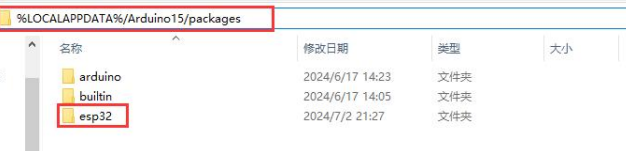

(3) Double click the [**esp32_package_2.0.11_arduinome.exe**](https://docs.hiwonder.com/projects/uHand_UNO/en/latest/docs/resources_download.html) to complete the installation.


## 8.2 Introduction to ESP32S3-Cam Vision Module

###  8.2.1 ESP32S3-Cam Introduction 

ESP32-CAM is a small-size camera module that can operate independently as the smallest system. Its is an ideal solution for IoT applications, which is widely applicable in scenarios such as whole-house smart connection, industrial control, smart agriculture, and more. It enables rapid development of solutions, providing users with highly reliable connectivity, and facilitating integration with various hardware terminal devices.


###  8.2.2 ESP32S3-Cam Expansion Board 

Interface Instruction:

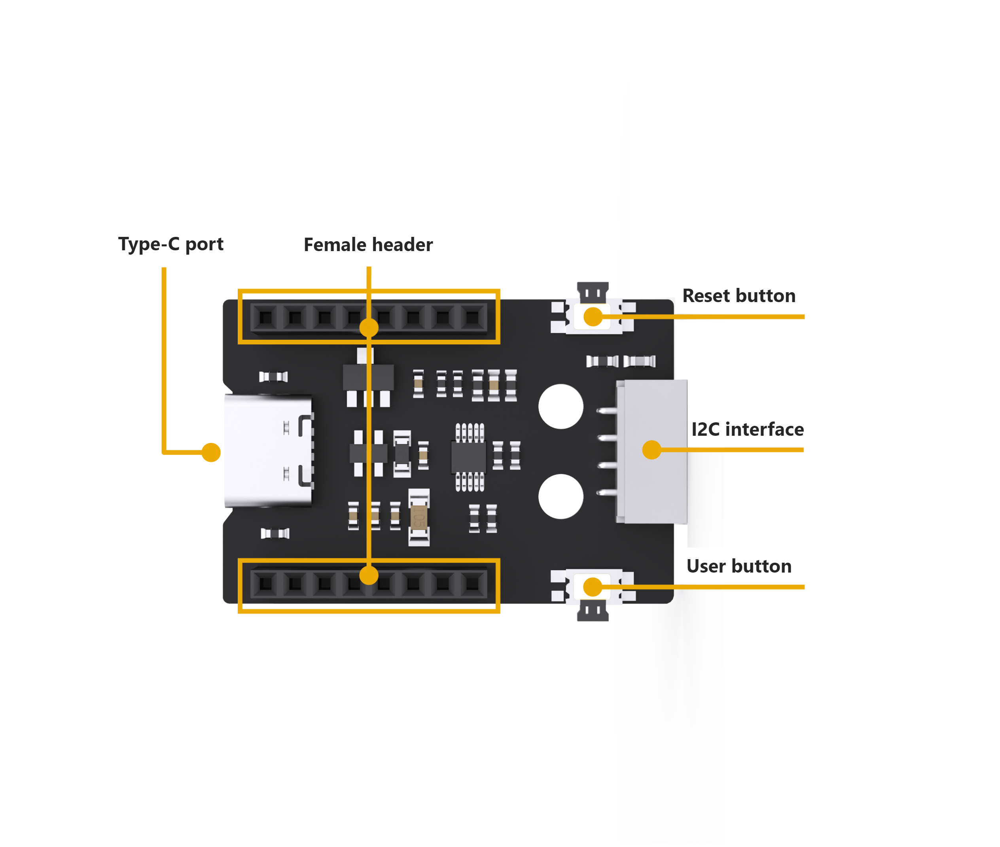

| **Interface Name** |                       **Instruction**                        |
| :----------------: | :----------------------------------------------------------: |
| Type C serial port |            Serial communication, firmware burning            |
|  Female connector  |                 Connect to ESP32-Cam module                  |
|    Reset button    |                 Press to restart the program                 |
|   IIC interface    | Secondary development interface, connecting with the main control. |
|    User button     |            User customized extension development             |

###  8.2.3 Notices 

(1) Ensure the module’s input power is at less 5V 2A; otherwise, the ripple patterns may appear in the image.

(2) The module comes with preinstalled firmware before leaving factory, which provides image transmission functionality. If you need to perform vision recognition features, you can flash the corresponding firmware.

## 8.3 ESP32S3-Cam Library File Introduction

This section explains the analysis for the drive library of the ESP32S3-Cam module. This library is used to obtain data on recognized face or color from the ESP32S3-Cam, as well as to control the brightness of the fill light. It includes two files **“hw_esp32cam_ctl.h”** and **“hw_esp32cam_ctl.cpp”**.

### 8.3.1 Getting Ready

(1) Open any program in the path of the **“8. AI Vision Game Course”**. Take **“8.5 Color Sorting”** as an example.

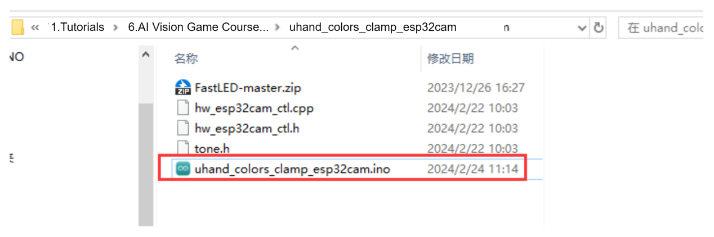

(2) In the program, select **“hw_esp32cam_ctl.cpp”**.

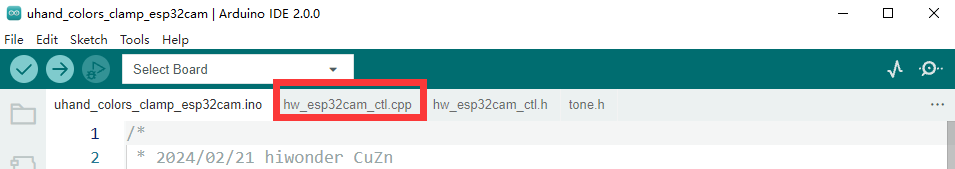

### 8.3.2 Brief Program Analysis 

(1) Initialize the function of I2C communication : `begin()`.

{lineno-start=7}

```
void HW_ESP32Cam::begin(void)
{
  Wire.begin();
}
```

(2) Send multiple bytes to esp32Cam : `wireWriteDataArray()`.

{lineno-start=12}

```
//写多个字节(write multiple bytes)
static bool wireWriteDataArray(uint8_t addr, uint8_t reg,uint8_t *val,unsigned int len)
{
    unsigned int i;

    Wire.beginTransmission(addr);
    Wire.write(reg);
    for(i = 0; i < len; i++) 
    {
        Wire.write(val[i]);
    }
    if( Wire.endTransmission() != 0 ) 
    {
        return false;
    }
    return true;
}
```

Parameters:

`addr`: esp32Cam device address（0x52）

`reg`: save the address within esp32Cam written target

`*val`: send-needing data address

`len`: send-needing word length

The Arduino master sends the device address via I2C first and the target memory address to esp32Cam. Then it sends the data by bytes according to the data length. Next, it checks if the data has been successfully transmitted using “endTransmission()”. If the return value is 0, it indicates successful data transmission; otherwise, it is fail to send.

(3) Send one byte to esp32Cam: `wireWriteByte()`.

{lineno-start=30}

```
static bool WireWriteByte(uint8_t val)
{
    Wire.beginTransmission(ESP32CAM_ADDR);
    Wire.write(val);
    if( Wire.endTransmission() != 0 ) {
        return false;
    }
    return true;
}
```

Parameter:

`val`: content of the sent data

The arduino master directly sends the device address and the data content of the 1 byte to esp32Cam. The “endTransmission()” checks the data sent successfully or not. If the return value is 0, the data is sent successfully. Otherwise it is sent unsuccessfully.

(4) Read the data of multiple bytes from esp32Cam: `wireReadData Array()`.

{lineno-start=40}

```
static int WireReadDataArray(uint8_t reg, uint8_t *val, unsigned int len)
{
    unsigned char i = 0;
    
    /* Indicate which register we want to read from */
    if (!WireWriteByte(reg)) {
        return -1;
    }
    
    /* Read block data */
    Wire.requestFrom(ESP32CAM_ADDR, len);
    while (Wire.available()) {
        if (i >= len) {
            return -1;
        }
        val[i] = Wire.read();
        i++;
    }   
    return i;
}
```

Parameters:

`reg`: the address of read-needing data in esp32Cam

`*val`: the address used for saving the data in Arduino master

`len`: Length of data to be read

The Arduino master first sends the address of the data to be read to esp32Cam. If there is no response, it returns -1, indicating a failed connection. Then, it sends the length of data to esp32Cam, and reads the data in bytes via the “while” loop and the “i” variables to store in the “val\[\]” array. During the reading process, if the actual read length exceeds the needed length, it returns to -1, indicating a reading failure. Finally, upon successful reading, it returns “i”, which represents the actual length of data read (where “i” may be less than or equal to “len”).

(5) Read the result of esp32Cam face detection: `faceDetect()`

{lineno-start=61}

```
//读取ESP32Cam检测人脸(read ESP32Cam detected face)
bool HW_ESP32Cam::faceDetect(void)
{
  uint8_t face_info[4];
  Serial.print("face ");
  int num = WireReadDataArray(0x01,face_info,4);
  if((num == 4) && (face_info[2] > 0)) //接收识别到的人脸的x,y,w,h值(receive x, y, w, and h values of the detected face)
  {
      Serial.println(" 1");
      return true;
  }
  Serial.println(" 0");
  return false;
}
```

Define the `face_info[4]` array to save the data. From 0x01address, read four bytes to save into the “face_info\[4\]” array through “wireReadDataArray()” function. The meaning of each element is as follows:

`face_info[0]` : x (the x-coordinate value identified at the upper-left corner of the face region)

`face_info[1]`: y (the y-coordinate value identified at the upper-left corner of the face region)

`face_info[2]` : w (the identified width of the face region)

`face_info[3]`: h (the identified height of the face region)

Receive the length of the data by `num` variable. If it is 4 and `face_info[2]` (the value of w) is more than 0, the face is identified to return ‘true’. Or return to ‘false’.

(6) Read the result of esp32Cam color reorganization: `colorDetect()`

{lineno-start=76}

```
//读取ESP32Cam识别颜色，返回颜色代号(read ESP32Cam recognized color and return color number)
int HW_ESP32Cam::colorDetect(void)
{
  uint8_t color_info[2][4];
  int num = WireReadDataArray(0x00,color_info[0],4);
  if((num == 4) && (color_info[0][2] > 0)) //接收识别到的颜色的x,y,w,h值(receive x, y, w, and h values of the recognized color)
  {
      return 2;
  }
  num = WireReadDataArray(0x01,color_info[1],4);
  if(num == 4)
  {
    if(color_info[1][2] > 0) //若w值大于0，则识别到颜色1(If the w value is greater than 0, the color 1 is recognized)
    {
      return 1;
    }
  }
  return 0;
}
```

Define `color_info[2][4]` bi-dimensional array to save the data, the meaning of each element is as below:

`color_info[*][0]` : x (the x-coordinate value identified at the upper-left corner of the color region)

`color_info[*][1]`: y (the y-coordinate value identified at the upper-left corner of the color region)

`color_info[*][2]`: w (the identified width of the color region)

`color_info[*][3]`: h (the identified height of the color region)

So if \* is “0”, the recognition color is 1. If \* is “1”, the recognition color is 2.

Using the `wireReadDataArray()` function, read four bytes of data from the address 0x00. These bytes represent the parameter information for color 1 detection and are stored in the `color_info[0][4]` array. Determine whether color 1 is detected based on the data length received by num and the value of `color_info[0][4]` (i.e., the width of the region where color 1 is detected). If num equals “4” and `color_info[0][2]` is greater than 0, color 1 is detected, and the function returns “1”.

If color 1 is not detected, according to the above steps, read data from the address 0x01 to store in the `color_info[1][4]` array, and then determine whether color 2 is detected. If it is detected, the function returns “2”.

If none of the above results, the function returns to “0”.

(7) Read the position of esp32Cam color recognition: `color_position()`

{lineno-start=96}

```
//读取ESP32Cam识别颜色位置，读取成功返回true和位置数据(read the recognied color position of ESP32Cam, and return true and position data if successfully read)
bool HW_ESP32Cam::color_position(uint16_t *color_info)
{
  int num = WireReadDataArray(0x01,(uint8_t*)color_info,8);
  if((num == 8) && (color_info[2] > 0)) //接收识别到的颜色的x,y,w,h值(receive x, y, w, and h values of the recognized color)
  {
    return true;
  }
  return false;
}
```

Parameter and meaning are as below:

`*color_info`： save the address of the received data

By the `wireReadDataArray()` function, eight bytes of data read from the address of 0x01 are stored in the address showed by `color_info[0][4]`. Judge whether recognizing the color or not according to the data length received by “num” and the value of  `color_info[2]`  (the recognized width of the color region). If  `num`  equals 8 and `color_info[2]` is greater than 0, it recognizes color to return to “true”. Or return to “false”.

## 8.4 Live Camera Feed

In this section, you can learn how to connect to the hotspot generated by the ESP32S3-Cam, and then log into a provided URL to view the live camera feed.

Note: if you are unable to use the live camera feed function or have downloaded other program firmwares, please reflash the image transmission firmware. This allows you to use the live camera feed function.

To download the firmware, please refer to “[8.4.2 Image Postback Firmware Flashing (Optional)]()” .

### 8.4.1 ESP32S3-Cam Camera Connection

* **Connection Modes Introduction**

ESP32S3-Cam has two kinds of network modes as follows:

① AP direct connection mode: the development board can open the hotspot to connect with the phone, but it cannot connect to an external network.

② STA LAN mode: the development board can actively connect to a designated hotspot or Wi-Fi, enabling communication with an external network.

The AP direct connection mode is more convenient to operate. We recommend you to first learn the configuration method of the direct connection mode to experience the corresponding functions. The STA LAN mode can be selected according to your needs.

No matter which kind of mode you choose, the game function is the same.

* **Direct Mode Connection (Must Read)**

(1) Make sure the camera is connected to the I2C interface on the expansion board and turn the robotic hand on.


(2) The camera will generate a hotspot named **“HW_ESP32Cam”**. Click to connect.


(3) After the connection is completed, enter the address “192.168.5.1” in the browser and click  to enter the camera transmission interface.


* **LAN Mode Connection (Optional)**

(1) Turn on your phone's hotspot and set the name as **“HiwonderESP”** and the password as **“Hiwonder”**. Note: the name and password of the hotspot should be same as of this text, otherwise the connection won't succeed.

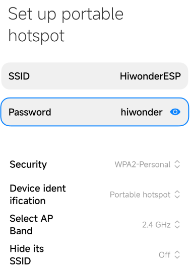

(2) Ensure the camera is connected to the I2C interface on the expansion board, power on the robotic hand and wait for a moment. The camera will automatically connect to the phone's hotspot.


(3) After that, connect the camera to the computer with the Type-C cable.

(4) Open the serial port utility tool in the path of  “[Appendix->erial Port Utility]()”.


(5) Select a port. Take COM3 as example. The port number may vary. Do not choose COM1 which is the system communication port. Set the baudrate as **“115200”**.


(6) Click  at the upper left of the page to open the serial port communication. Press the “RST” button on the ESP32S3-Cam and scroll down to the last line to check your camera's IP address “192.168.197.226”. The IP address may vary, please refer to the actual address.


(7) At this time, you can disconnect the Type-C cable and connect the computer to the same hotspot as the camera.

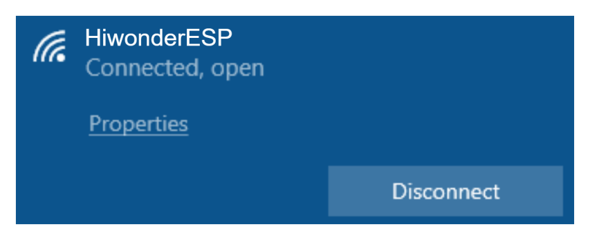

(8) In the browser’s research bar, enter the IP address of the camera **“192.168.197.226”** to  access the feedback interface.


### 8.4.2 Image Postback Firmware Flashing (Optional)

(1) Open the “[flash_download_tool_3.9.7]()” file.


(2) Select the **“Chip Type”** as **“ESP32-S3”**, and keep others unchanged. Click **“OK”**.

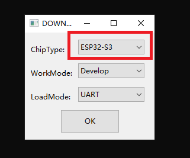

(3) After opening the tool, click “...” to select the bin file of the program to be flashed. Take the following live camera feed function firmware as an example:


(4) Check the left side box, the rest of the configuration can be configured as shown below. Select the port number of the vision module occupied in the device as the COM port number .

:::{Note}

If you set SPI MODE to DIO as shown in the figure below, and the module cannot work properly after the firmware is flashed, please try setting SPI MODE to DOUT and flashing again.

:::


(5) Click **“ERASE”** to erase the underlayer firmware. You must do this step first. Next, click **“START”** to start flash. Then, wait for the download to be completed.

## 8.5 Color Sorting

In this section, miniArm will use the ESP32S3-Cam to recognize blue and green blocks, and then grasp and place them in their respective positions.

### 8.5.1 Program Flowchart


### 8.5.2 ESP32S3-Cam Development Board 

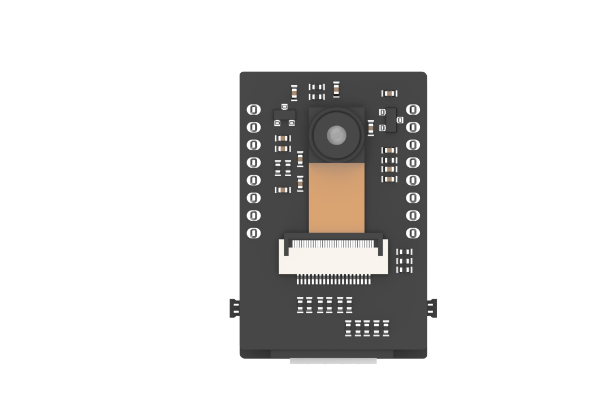

ESP32S3-Cam development board integrates an ESP32 chip and a camera module. After being inserted into the expansion board, it uses the I2C communication interface to read color and face data through I2C communication.

* **Wiring**

Align the pins of ESP32S3-Cam with the pin headers on the camera expansion board, and connect it to an I2C interface on the miniArm expansion board with a 4PIN wire.


### 8.5.3 Program Download 

:::{Note}

- Remove the Bluetooth module before downloading the program. Or the program will fail to download because of the serial port conflict.

- Please switch the battery box to the “OFF” when connecting the Type-B download cable. This action prevents the download cable from accidentally touching the power pins of the expansion board, which may cause a short circuit.

:::

* **Arduino UNO Program Download**

[MiniArm_color_clamp]()

(1) Locate and open the **“MiniArm_color_clamp\MiniArm_color_clamp.ino”** program file in the same directory as this section.

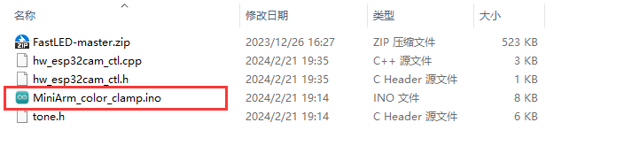

(2) Connect Arduino to the computer with the UNO cable (Type-B).


(3) Click **“Select Development Board”**, and the software will automatically detect the current Arduino serial port. Next, click to connect.


(4) Click  to download the program into Arduino. Then just wait for it to complete.


* **ESP32S3-Cam Program Download**

[ESP32Cam_color_clamp]()

(1) Connect the ESP32S3-Cam to the computer with a Type-C data cable.

(2) Locate and open the **“ColorDetection\ColorDetection.ino”** program file.


(3) Select the **“ESP32S3 Dev Module”** development board.


(4) Click the **“Tool”** in the menu bar, and select the corresponding configuration for the ESP32S3 development board.


(5) Click to download the program to the ESP32S3-Cam, and then wait for the download to complete.


### 8.5.4 Program Outcome

(1) After being powered on, the robotic arm enters the initial position of grasping, and the RGB light on the expansion board lights up blue.

(2) When a blue block is identified, the RGB lights up blue. The robotic arm grasps the block and places it to the left.

(3) When a green block is identified, the RGB lights up green. The robotic arm grasps the block and places it to the right.

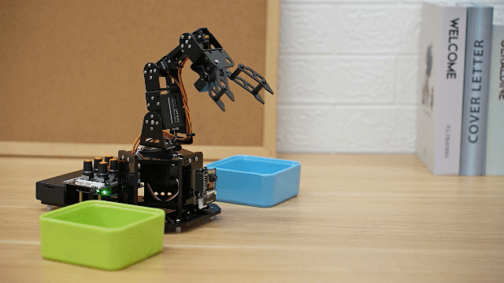

### 8.5.5 Brief Program Analysis

* **Import Library File**

(1) Import the RGB control library, servo control library, ESP32Cam communication library, and buzzer tone library files required for this program.

{lineno-start=7}

```
#include <FastLED.h> //导入LED库(import LED library)
#include <Servo.h> //导入舵机库(import servo library)
#include "hw_esp32cam_ctl.h" //导入ESP32Cam通讯库(import ESP32S3-Cam communication library)
#include "tone.h" //音调库(tone library)
```

(2) Define tone and color constants.

{lineno-start=13}

```
#define COLOR_1   1
#define COLOR_2   2

const static uint16_t DOC5[] = { TONE_C5 };
const static uint16_t DOC6[] = { TONE_C6 };
```

* **Define Pin and Create Object**

(1) Firstly, define the Arduino pins used for hardware connections, mainly consisting of five servo pins, one buzzer pin, and one RGB light pin.

{lineno-start=19}

```
/* 引脚定义(define pins) */
const static uint8_t servoPins[5] = { 7, 6, 5, 4, 3};//舵机引脚定义(define servo pins) 
const static uint8_t buzzerPin = 11;
const static uint8_t rgbPin = 13;
```

(2) Then, define the control objects of RGB lights, ESP32Cam communication, action groups, and servos. The variables of the servo control are also created. The `limit_angle` sets angle limits for each joint of the robotic arm. The “servo_angles” array is used to store the actual angles of each servo, ranging from 0 to 180.

{lineno-start=24}

```
//RGB light control object
static CRGB rgbs[1];
//ESP32Cam communication object
HW_ESP32Cam hw_cam;
//action group control object
HW_ACTION_CTL action_ctl;
//servo control object
Servo servos[5];

/* The limit of each joint’s angle */
const uint8_t limt_angles[5][2] = {{0,82},{0,180},{0,180},{0,180},{0,180}}; 
/* The actual angle value of the servo control */
static uint8_t servo_angles[5] = { 40,21,159,115,90 }; 
```

(3) The construction function of the action group’s control object defines the variable `extended_func_angles`, which is the desired angle value of servo angles. The related functions used to control executing action groups are also defined.

{lineno-start=11}

```
class HW_ACTION_CTL{
  public:
    uint8_t extended_func_angles[5] = { 40,21,159,115,90 }; /* 二次开发例程使用的角度数值(the angle values used for the secondary development program) */
    //控制执行动作组(control the action group to be executed)
    void action_set(int num);
    int action_state_get(void);
    void action_task(void);
    void read_offset(void);
    int8_t* get_offset(void);
    
  private:
    //动作组控制变量(action group contorl variable)
    int action_num = 0;
    uint8_t servo_offset[5];
    uint8_t eeprom_read_buf[16];
};
```

Control executing action group

Control variable of action group

Regarding the desired and actual values, there may be differences between them during the process of controlling the servo rotation due to various factors. You can check in the `servo_control` function called in the `loop` main function.

If you want the servo to gradually move towards the target position, you need to call `servo_angles[i] = servo_angles[i] * 0.9 + extended_func_ angles[i] * 0.1` in the control task function.

This allows the servo to move each time at 90% of the actual value and 10% of the expected value, so that the actual value will gradually approach the expected value. And when it is equal to the expected value, the robotic arm stops moving.

{lineno-start=169}

```
  for (int i = 0; i < 5; ++i) {
    if(servo_angles[i] > action_ctl.extended_func_angles[i])
    {
      servo_angles[i] = servo_angles[i] * 0.9 + action_ctl.extended_func_angles[i] * 0.1;
      if(servo_angles[i] < action_ctl.extended_func_angles[i])
        servo_angles[i] = action_ctl.extended_func_angles[i];
    }else if(servo_angles[i] < action_ctl.extended_func_angles[i])
    {
      servo_angles[i] = servo_angles[i] * 0.9 + (action_ctl.extended_func_angles[i] * 0.1 + 1);
      if(servo_angles[i] > action_ctl.extended_func_angles[i])
        servo_angles[i] = action_ctl.extended_func_angles[i];
    }

    servo_angles[i] = servo_angles[i] < limt_angles[i][0] ? limt_angles[i][0] : servo_angles[i];
    servo_angles[i] = servo_angles[i] > limt_angles[i][1] ? limt_angles[i][1] : servo_angles[i];
    servos[i].write(i == 0 || i == 5 ? 180 - servo_angles[i] : servo_angles[i]);
  }
}
```

(4) Next, the variable used for controlling the buzzer is defined. Please note that task functions execute different control tasks. The `servo_control` function controls the servo. The `play_tune()` function sets the buzzer’s sound. The `tune_task` function controls the buzzer. And the `espcam_task` function processes the corresponding communication of the ESP32S3-Cam.

{lineno-start=44}

```
static void servo_control(void); /* servo control */
void play_tune(uint16_t *p, uint32_t beat, uint16_t len); /* buzzer control connector */
void tune_task(void); /* buzzer control task */
void espcam_task(void); /* esp32cam communication task */
```

* **Initialization**

(1) The `setup ()` function mainly initializes associated hardware devices. Starting with the serial port, which sets the baud rate as **“115200”** and a read timeout as 500ms.

{lineno-start=49}

```
void setup() {
  // put your setup code here, to run once:
  Serial.begin(115200);
  // set the timeout for reading data from the serial port
  Serial.setTimeout(500);
```

(2) Assign the servo IO port to facilitate the control through the pin.

{lineno-start=56}

```
  // Assign the servo IO port
  for (int i = 0; i < 5; ++i) {
    servos[i].attach(servoPins[i]);
  }
```

(3) Initialize the communication connector of ESP32S3-Cam.

{lineno-start=61}

```
  hw_cam.begin(); //initialize the ESP32Cam communication connector
  hw_cam.set_led(10); // control ESP32Cam fill light brightness [brightness value (0~255)]
```

(4) Use the `FastLED` library to initialize the RGB lights on the expansion board, and connect them to the RGB pins. Then set the color to blue by `rgbs[0] = CRGB(0, 0, 100)` and use the `FastLED.show` function to display the set color.

{lineno-start=64}

```
  //Initialize and control the RGB light
  FastLED.addLeds<WS2812, rgbPin, GRB>(rgbs, 1);
  rgbs[0] = CRGB(0, 0, 100);
  FastLED.show();
```

(5) Set the pin of the buzzer to output mode and stop activating the buzzer after a short sound.

{lineno-start=72}

```
  pinMode(buzzerPin, OUTPUT);
  tone(buzzerPin, 1000);
  delay(100);
  noTone(buzzerPin);
```

(6) Output the **“Start"** string through a serial port to indicate that the sensor is ready to start transmitting data.

{lineno-start=77}

```
  delay(2000);
  Serial.println("start");
```


* **Call Subfunction in a Loop**

After finishing the initialization, it enters the `loop` main function. First, call the `espcam_task` function which is used to detect color identification and perform grasp and placement. Then, call the `tune_task` function to execute buzzer task. Next, call the `servo_control` function to control servos. Finally, call the `action_task()` to execute the action group.

{lineno-start=81}

```
void loop() {
  // esp32cam communication task
  espcam_task();
  // buzzer sound task
  tune_task();
  // servo control
  servo_control();
  // action group running task
  action_ctl.action_task();
}
```

* **ESP32S3-Cam Communication Task**

(1) In definition of the `espcam_task` function, the `last_tick` records the timestamp of the last task execution; the `step` tracks the current stage of task execution; the `act_num` records action group numbers to be called; the `delay_count` sets counting unit for the demonstration; and `color` stores detection result from the camera.

{lineno-start=93}

```
void espcam_task(void)
{
  static uint32_t last_tick = 0;
  static uint8_t step = 0;
  static uint8_t act_num = 0;
  static uint32_t delay_count = 0;
  int color = 0;
```

(2) The `last_tick` variable and `millis()` are used for delay operation. Specifically, use the `millis()` function to obtain the running time of the program minus the `last_tick`  variable. If the difference is less than 100, the function will return. If the difference is greater than or equal to 100, it means the task has been delayed by 100ms. Then the current time is assigned to the `last_tick` variable for the next delay.

{lineno-start=101}

```
  // time intervals 100ms
  if (millis() - last_tick < 100) {
    return;
  }
  last_tick = millis();
```

(3) Perform corresponding tasks based on the detected color, such as controlling RGB LED, buzzer, and the angle of servo. Here is the analysis of this `switch` code snippet:

{lineno-start=107}

```
  switch(step)
  {
    case 0:
      color = hw_cam.colorDetect(); //obtain color
      if(color == COLOR_1) //if the color 1 is recognized
      {
        rgbs[0].r = 0;
        rgbs[0].g = 250;
        rgbs[0].b = 0;
```

**Case 0 :** use `hw_cam.colorDetect()` to detect color. If color 1 is detected, RGB lights up red and the buzzer sounds to enter the next state. If blue is detected, same as this way.

{lineno-start=109}

```
    case 0:
      color = hw_cam.colorDetect(); //obtain color
      if(color == COLOR_1) //if the color 1 is recognized
      {
        rgbs[0].r = 0;
        rgbs[0].g = 250;
        rgbs[0].b = 0;
        FastLED.show();
        play_tune(DOC6, 300u, 1u);
        // to run action group 1 for color sorting
        act_num = 1;
        step++;
```

Turn off the RGB light if no target color is detected.

{lineno-start=131}

```
      }else{ //If no target color is detected
        rgbs[0].r = 0;
        rgbs[0].g = 0;
        rgbs[0].b = 0;
        FastLED.show();
      }
      break;
```

**Case 1:** wait for some time before recording the running action group numbers, and proceeding to the next state.

{lineno-start=138}

```
    case 1: //wait for 1s to place the block well
      delay_count++;
      if(delay_count > 10)
      {
        delay_count = 0;
        // run action group
        action_ctl.action_set(act_num);
        act_num = 0;
        step++;
      }
      break;
```

**Case 2:** wait for the action status to reset. If the action group running is finished, set the “step” to 0 to restart detecting the color.

{lineno-start=149}

```
    case 2: //wait for the action status to reset
      if(action_ctl.action_state_get() == 0)
      {
        step = 0;
      }
      break;
    default:
      step = 0;
      break;
```

* **Action Group Running Task**

{lineno-start=35}

```
void HW_ACTION_CTL::action_task(void){
```

(1) Initially, the variables for action group running are created: `last_tick` is used for a short delay; `step` is the current stage of action group running; `num` temporarily stores several actions in action group running; and `delay_count` is used for delay to wait for the ending of the action running.

{lineno-start=36}

```
  static uint32_t last_tick = 0;
  static uint8_t step = 0;
  static uint8_t num = 0 , delay_count = 0;
```

(2) Switch is the actual part of called action group. The detailed analysis is as below:

**Case 0:** To run action group. Transmit the action in the action group to the desired angle of the servo `extended_func_angles` to process to the next stage. If `num=0`, it means the action running is complete. The action group variable will be reset and jump out of the loop.

{lineno-start=47}

```
    switch(step)
    {
      case 0: //运行动作
        if(action[action_num-1][num][0] != 0)
        {
          for(int i = 0;i < 5;i++){
            if(action[action_num-1][num][i+1] + servo_offset[i] > 180){
              extended_func_angles[i] = 180;
            }else if (action[action_num-1][num][i+1] + servo_offset[i] < 0) {
              extended_func_angles[i] = 0;
            }else {
              extended_func_angles[i] = action[action_num-1][num][i+1] + servo_offset[i];
            }
          }

          step = 1;

        }else{ //若运行完毕
          num = 0;
          // 清空动作组变量
          action_num = 0;
          
        }
        break;
```

**Case 1:** use the `delay_count` variable to delay and wait for the action running. Then proceed “num+1” to case 0 to start executing the next action.

{lineno-start=71}

```
      case 1: //等待动作运行
        delay_count++;
        if(delay_count > 2)
        {
          num++;
          delay_count = 0;
          step = 0;
        }
        break;
```

* **Servo Control**

If you want the servo to close to the target position, call 5 lines of codes `servo_angles[i] = servo_angles[i] * 0.85 + extended_func_angles[i] * 0.15` in the control task function.

This allows the servo to move each time by 85% of the actual value and 15% of the desired value, so that the actual value gets progressively closer to the desired value. Once they are equal, the robotic arm stops moving.

{lineno-start=159}

```
void servo_control(void) {
  static uint32_t last_tick = 0;
  if (millis() - last_tick < 20) {
    return;
  }
  last_tick = millis();

  for (int i = 0; i < 5; ++i) {
    if(servo_angles[i] > action_ctl.extended_func_angles[i])
    {
      servo_angles[i] = servo_angles[i] * 0.9 + action_ctl.extended_func_angles[i] * 0.1;
      if(servo_angles[i] < action_ctl.extended_func_angles[i])
        servo_angles[i] = action_ctl.extended_func_angles[i];
    }else if(servo_angles[i] < action_ctl.extended_func_angles[i])
    {
      servo_angles[i] = servo_angles[i] * 0.9 + (action_ctl.extended_func_angles[i] * 0.1 + 1);
      if(servo_angles[i] > action_ctl.extended_func_angles[i])
        servo_angles[i] = action_ctl.extended_func_angles[i];
    }

    servo_angles[i] = servo_angles[i] < limt_angles[i][0] ? limt_angles[i][0] : servo_angles[i];
    servo_angles[i] = servo_angles[i] > limt_angles[i][1] ? limt_angles[i][1] : servo_angles[i];
    servos[i].write(i == 0 || i == 5 ? 180 - servo_angles[i] : servo_angles[i]);
  }
}
```

* **Buzzer Control**

Control the buzzer to play a melody according to the specified rhythm and tone array.

{lineno-start=186}

```
void tune_task(void) {
  static uint32_t l_tune_beat = 0;
  static uint32_t last_tick = 0;
  // 若未到定时时间 且 响的次数跟上一次的一样
  if (millis() - last_tick < l_tune_beat && tune_beat == l_tune_beat) {
    return;
  }
  l_tune_beat = tune_beat;
  last_tick = millis();
  if (tune_num > 0) {
    tune_num -= 1;
    tone(buzzerPin, *tune++);
  } else {
    noTone(buzzerPin);
    tune_beat = 10;
    l_tune_beat = 10;
  }
}
```

(1) Declare variables. The `l_tune_beat` variable is used for storing the interval between the last played tones (in milliseconds); the “last_tick” variable is used for storing timestamp of the last function execution. Control the buzzer to play a melody according to specified rhythm and tone.

{lineno-start=187}

```
  static uint32_t l_tune_beat = 0;
  static uint32_t last_tick = 0;
```

(2) Determine whether the tone needs to be played. Using the `millis()` function to get current timestamp and to compare with the `last_tick`. If the interval between current time and last played time is less than `l_tune_beat`, and the value of `tune_beat` does not change (i.e. “tune_beat” is equal to “l_tune_beat”), the function returns directly without executing any operation. This is to prevent the same tone from being played repeatedly in the same interval.

{lineno-start=190}

```
  if (millis() - last_tick < l_tune_beat && tune_beat == l_tune_beat) {
    return;
  }
```

(3) Update variables. Assign the value of `tune_beat` to `l_tune_beat`, and update the `last_tick` as the current timestamp.

{lineno-start=193}

```
  l_tune_beat = tune_beat;
  last_tick = millis();
```

(4) If  `tune_num`  is larger than 0, it means that there are still tones that need to be played. Then use the `tone()` function to play current tone in buzzer pin.

{lineno-start=195}

```
  if (tune_num > 0) {
    tune_num -= 1;
    tone(buzzerPin, *tune++);
```

(5) If `tune_num` is less than 0, it means all tones have been played. Use the `noTone()` function to stop the buzzer from sounding, and reset `tune_beat` and `l_tune_beat` to 10 (that is, the buzzer task runs at an interval of 10ms) in preparation for the next playback of the melody.

{lineno-start=257}

```
  } else {
    noTone(buzzerPin);
    tune_beat = 10;
    l_tune_beat = 10;
  }
}
```

* **Buzzer Sound**

Specify the tone array, the interval between the tones, and the number of tones to be played.

{lineno-start=206}

```
void play_tune(uint16_t *p, uint32_t beat, uint16_t len) {
  tune = p;
  tune_beat = beat;
  tune_num = len;
}
```

`tune = p`  sets variable `tune` (a pointer to an array of tones) to the value of the passed parameter p. In this way, “tune” points to an array of tones provided by the user.

`tune_beat = beat` sets variable `tune_beat` (it means the interval between tones to be played) to the value of the passed parameter “beat”, which determines the tempo of the tone.

`tune_num = len`  sets variable `tune_num` (it means the number of tones to be played) to the value of the passed parameter `len`, which determines the length of the playlist.

### 8.5.6 Function Extension

How to modify the recognized color of ESP32S3-Cam? You can refer to the following steps:

(1) Locate and open the “[ESP32S3-Cam Color Recognition program\HSV\HSV.dist\HSV.exe]()” program file in the same path as this lesson.


(2) Select the image file to be imported. The imported image needs to be stored in the “img” folder.

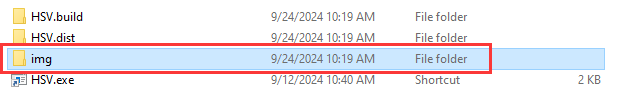

(3) Drag the slider to segment the image with HSV threshold, and adjust it to the appropriate HSV threshold range. You can refer to the following color range table.

:::{Note}

Image stretching due to resolution does not affect threshold debugging.

:::


(4) Save the HSV threshold. Locate and open the “[ESP32S3-Cam Color Recognition Program\ColorDetection\color_detection.cpp]()” file in the same path as this lesson. Modify the color data to the saved HSV array. Next, refer to “[ESP32S3-Cam Program Download]()” to flash the modified program into ESP32S3-Cam.


:::{Note}

The elements of the array are separated with commas.

:::

(5) Once the flashing is completed, the ESP32S3-Cam can recognize the object with other colors.

### 8.5.7 FAQ

**Q:**Since the code was upload, the color can not be recognized.

**A:**Please check that you have connected the 4-pin cable to the I2C interface and turn the knob on the expansion board to the initial position.

**Q:**Why is the color recognized by the camera inaccurate or even incorrect?

**A:**Please try to minimize the complexity of the background. You can use a single color or a simple environment as the background.

## 8.6 Color Tracking

In this section, miniArm will use ESP32S3-Cam to recognize a blue block, making the robotic arm track the blue block and turn left and right accordingly.

### 8.6.1 Program Flowchart

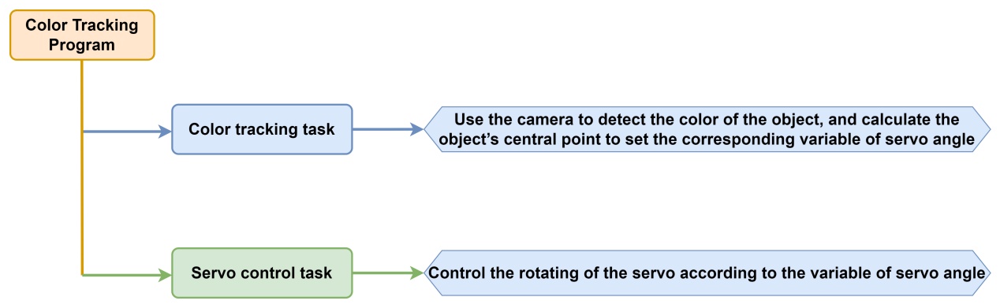

### 8.6.2 ESP32S3-Cam Development Board 


ESP32S3-Cam development board integrates an ESP32 chip and a camera module. After being inserted into the expansion board, it uses the I2C communication interface to read color and face data through I2C communication.

* **Wiring**

Align the pins of ESP32S3-Cam with the pin headers on the camera expansion board, and connect it to an I2C interface on the miniArm expansion board with a 4PIN wire.


### 8.6.3 Program Download

:::{Note}

- Remove the Bluetooth module before downloading the program. Or the program will fail to download because of the serial port conflict.

- Please switch the battery box to the “OFF” when connecting the Type-B download cable. This action prevents the download cable from accidentally touching the power pins of the expansion board, which may cause a short circuit.

:::

* **Arduino UNO Program Download**

[MiniArm_color_trace]()

(1) Locate and open the **“MiniArm_color_trace\MiniArm_color_trace.ino”** program file in the same directory as this section.

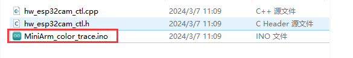

(2) Connect Arduino to the computer with the UNO cable (Type-B).


(3) Click **“Select Development Board”**, and the software will automatically detect the current Arduino serial port. Next, click to connect.


(4) Click  to download the program into Arduino. Then just wait for it to complete.


* **ESP32S3-Cam Program Download**

[ESP32Cam_color_trace]()

(1) Connect the ESP32S3-Cam to the computer with a Type-C data cable.

(2) Locate and open the **“ColorDetection\ColorDetection.ino”** program file in the same directory as this section.


(3) Select the **“ESP32S3 Dev Module”** development board.


(4) Click the **“Tool”** in the menu bar, and select the corresponding configuration for the ESP32S3 development board.


(5) Click to download the program to the ESP32S3-Cam, and then wait for the download to complete.


### 8.6.4 Program Outcome

(1) After the robotic arm is powered on, its pan-tilt returns to the initial position, and the RGB light on the expansion board lights up blue.

(2) When you place the blue block in front of the ESP32S3-Cam camera and move it left and right, the robotic arm’s pan-tilt tracks its movement turning left and right accordingly.

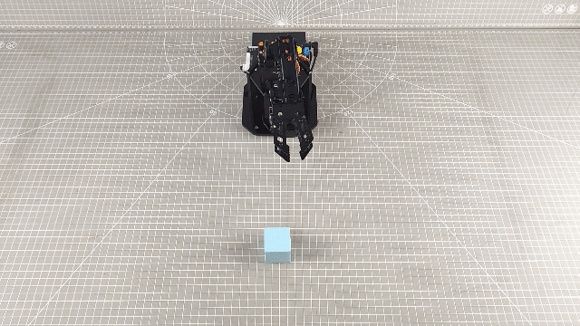

### 8.6.5 Brief Program Analysis

[MiniArm_color_trace]()

[ESP32Cam_color_trace]()

* **Import Library File**

Import the required libraries for RGB control, servo control, buzzer tone, and the ESP32Cam library files for the game.

{lineno-start=7}

```
#include <FastLED.h> //导入LED库(import LED library)
#include <Servo.h> //导入舵机库(import servo library)
#include "hw_esp32cam_ctl.h" //导入ESP32Cam通讯库(import ESP32S3-Cam communication library)
#include <EEPROM.h>
```

* **Define Pin and Create Object**

(1) Firstly, define the buzzer tone and pins, mainly including servo pins, the buzzer pin, and the hardware interface of the RGB light.

{lineno-start=18}

```
const static uint8_t servoPins[5] = { 7, 6, 5, 4, 3 };
const static uint8_t buzzerPin = 11;
const static uint8_t rgbPin = 13;
```

(2) Then, create the objects for RGB light control, ESP32Cam communication, and servo control.

{lineno-start=22}

```
//RGB灯控制对象(RGB light control object)
static CRGB rgbs[1];
//ESP32Cam通讯对象(ESP32Cam communication object)
HW_ESP32Cam hw_cam;
//舵机控制对象(servo control object)
Servo servos[5];
```

(3) Next, define the correlation variables controlling servo angles. The array `extended_func_angles[5]` is the desired angles used to uniformly rotate the servos to their designated positions. The `limt_angles[5][2]` is the servo angle limit used to prevent the servos rotating to the physical limit from damaging them. The `servo_angles[5]` is the actual angles of the servos, indicating the current actual angles of the servos.

{lineno-start=29}

```
/* The used angle values of secondary development example */
static uint8_t extended_func_angles[5] = { 90,115,180,120,90 }; 
/* Limit of each joint’s angle */
const uint8_t limt_angles[5][2] = {{0,90},{0,180},{0,180},{25,180},{0,180} }; 
/* Actual angle values of servo control */
static uint8_t servo_angles[5] = { 90,115,180,120,90 };  
static int8_t servo_offset[5];
static uint8_t servo_expect[5];
static uint8_t eeprom_read_buf[16];
```

Regarding the desired and actual values, there may be differences between them during the process of controlling the servo rotation due to various factors. You can check the `servo_control` function called in the `loop` main function.

If you want the servo to gradually move towards the target position, you need to call `servo_angles[i] = servo_angles[i] * 0.9 + extended _func_ a ngles[i] * 0.1` in the control task function.

This allows the servo to move each time at 90% of the actual value and 10% of the expected value, so that the actual value will gradually approach the expected value. And when it is equal to the expected value, the robotic arm stops moving.

{lineno-start=103}

```
void servo_control(void) {
  static uint32_t last_tick = 0;
  if (millis() - last_tick < 20) {
    return;
  }
  last_tick = millis();
  for (int i = 0; i < 5; ++i) {
    servo_expect[i] = extended_func_angles[i] + servo_offset[i];
    if(servo_angles[i] > servo_expect[i])
    {
      servo_angles[i] = servo_angles[i] * 0.9 + servo_expect[i] * 0.1;
      if(servo_angles[i] < servo_expect[i])
        servo_angles[i] = servo_expect[i];
    }else if(servo_angles[i] < servo_expect[i])
    {
      servo_angles[i] = servo_angles[i] * 0.9 + (servo_expect[i] * 0.1 + 1);
      if(servo_angles[i] > servo_expect[i])
        servo_angles[i] = servo_expect[i];
    }

    servo_angles[i] = servo_angles[i] < limt_angles[i][0] ? limt_angles[i][0] : servo_angles[i];
    servo_angles[i] = servo_angles[i] > limt_angles[i][1] ? limt_angles[i][1] : servo_angles[i];
    servos[i].write(i == 0 || i == 5 ? 180 - servo_angles[i] : servo_angles[i]);
  }
}
```

(4) Finally, declare the servo’s control function and the ESP32Cam communication task.

{lineno-start=39}

```
static void servo_control(void); /* servo control */
void espcam_task(void); /* esp32cam communication task */
static void read_offset(void);
```

* **Initialization**

(1) The  `setup ()`  function mainly initializes associated hardware devices. Starting with the serial port, which sets the baud rate as **“115200”** and a read timeout as 500ms.

{lineno-start=43}

```
void setup() {
  // put your setup code here, to run once:
  Serial.begin(115200);
  // set the timeout for reading data from the serial port
  Serial.setTimeout(500);
```

(2) Assign the servo IO port to facilitate the control through the pin.

{lineno-start=50}

```
  for (int i = 0; i < 5; ++i) {
    servos[i].attach(servoPins[i]);
  }
```

(3) Initialize the ESP32Cam communication connector and open the fill light.

{lineno-start=54}

```
  hw_cam.begin(); //initialize the ESP32Cam communication connector
  hw_cam.set_led(10); // control ESP32Cam fill light brightness [brightness value (0~255)]
```

(4) Use the `FastLED` library to initialize the RGB lights on the expansion board, and connect them to the RGB pins. Then set the color to blue by `rgbs[0] = CRGB(0, 0, 100)` and use the `FastLED.show` function to display the set color.

{lineno-start=58}

```
  FastLED.addLeds<WS2812, rgbPin, GRB>(rgbs, 1);
  rgbs[0] = CRGB(0, 0, 100);
  FastLED.show();
```

(5) Set the pin of the buzzer to output mode and stop activating the buzzer after a short sound.

{lineno-start=65}

```
  pinMode(buzzerPin, OUTPUT);
  tone(buzzerPin, 1000);
  delay(100);
  noTone(buzzerPin);
```

(6) Output the `Start` string through a serial port to indicate that the sensor is ready to start transmitting data.

{lineno-start=70}

```
  delay(2000);
  Serial.println("start");
}
```

* **Call Subfunction in a Loop**

After initialization is complete, the program enters the main “loop” function, where it cyclically calls the `espcam_task` function to communicate with the ESP32Cam. Based on the color recognition results, it performs arm rotation operations. Additionally, it calls the `servo_control` function to control the servos.

{lineno-start=74}

```
void loop() {
  // esp32cam communication task
  espcam_task();
  // servo control
  servo_control();
}
```

* **ESP32S3-Cam Communication Task**

(1) Define the `espcam_task` function. First, two variables are defined. The `last_tick` variable and `millis()` are used for delay operation. Specifically, use the `millis()` function to obtain the running time of the program minus the `last_tick` variable. If the difference is less than 75, the function will return; if the difference is greater than or equal to 75, it indicates the task has been delayed by 75ms. Then the current time is assigned to the `last_tick` variable for the next delay operation.

The `color_info[4]` array is used to store the return data of the esp32cam. The data corresponding to the subscript is: \[0\] is the x-coordinate of the upper left corner of the recognized color, \[1\] is the y-coordinate of the upper left corner of the recognized color, \[2\] is the width of the recognized color range, and \[3\] is the height of the recognized color range.

{lineno-start=82}

```
void espcam_task(void)
{
  static uint32_t last_tick = 0;
  uint16_t color_info[4];

  // time intervals
  if (millis() - last_tick < 75) {
    return;
  }
  last_tick = millis();
```

(2) Next, use the `color_position()` function to determine if the specified color is recognized. If it is recognized, calculate the center point of the color block. Map the position of the center point to the corresponding servo angle and then control the servo’s movement tracking.

{lineno-start=93}

```
  if(hw_cam.color_position(color_info)) //if the color is recognized
  {
    uint16_t num = color_info[0] + color_info[2]/2; //calculate the center point of the color block
    uint16_t angle = map(num , 0 , 320 , 60 , 120); //Map to the corresponding servo angle
    extended_func_angles[4] = angle; ///control servo’s movement tracking
  }
}
```

* **Servo Control Task**

To calculate and set the angle for each servo based on the target angles in the  `extended_func_angles` array, the current angles in the  `servo_angles` array, and the angle limits.

{lineno-start=103}

```
void servo_control(void) {
  static uint32_t last_tick = 0;
  if (millis() - last_tick < 20) {
    return;
  }
  last_tick = millis();
  for (int i = 0; i < 5; ++i) {
    servo_expect[i] = extended_func_angles[i] + servo_offset[i];
    if(servo_angles[i] > servo_expect[i])
```

(1) Check the time interval since the last execution. If the interval is less than 20ms, the function will return immediately to avoid updating the servo angle too frequently.

{lineno-start=103}

```
void servo_control(void) {
  static uint32_t last_tick = 0;
  if (millis() - last_tick < 20) {
    return;
  }
  last_tick = millis();
```

(2) By checking the difference between the `servo_angles[i]` (current servo angles) and the `extended_func_angles[i]` (target angles), adjust the servos’ rotation angles smoothly.

{lineno-start=109}

```
  for (int i = 0; i < 5; ++i) {
    servo_expect[i] = extended_func_angles[i] + servo_offset[i];
    if(servo_angles[i] > servo_expect[i])
    {
      servo_angles[i] = servo_angles[i] * 0.9 + servo_expect[i] * 0.1;
      if(servo_angles[i] < servo_expect[i])
        servo_angles[i] = servo_expect[i];
    }else if(servo_angles[i] < servo_expect[i])
    {
      servo_angles[i] = servo_angles[i] * 0.9 + (servo_expect[i] * 0.1 + 1);
      if(servo_angles[i] > servo_expect[i])
        servo_angles[i] = servo_expect[i];
    }
```

Check if the current servo angles are greater than the target angles. If they are, smoothly adjust the angles by taking small steps toward the target angles (each step is 90% of the current angles plus 10% of the target angles).

{lineno-start=109}

```
  for (int i = 0; i < 5; ++i) {
    servo_expect[i] = extended_func_angles[i] + servo_offset[i];
    if(servo_angles[i] > servo_expect[i])
    {
      servo_angles[i] = servo_angles[i] * 0.9 + servo_expect[i] * 0.1;
```

If the current servo angles are still greater than the target angles, directly set them to the target angles.

{lineno-start=114}

```
      if(servo_angles[i] < servo_expect[i])
        servo_angles[i] = servo_expect[i];
```

Check if the current servo angles are less than the target angles. If they are, smoothly adjust the angles by taking small steps toward the target angles (each step is 90% of the current angles plus 10% of the target angles plus 1).

{lineno-start=116}

```
    }else if(servo_angles[i] < servo_expect[i])
    {
      servo_angles[i] = servo_angles[i] * 0.9 + (servo_expect[i] * 0.1 + 1);
```

If the current servo angles are still less than the target angles, directly set them to the target angles.

{lineno-start=119}

```
      if(servo_angles[i] > servo_expect[i])
        servo_angles[i] = servo_expect[i];
    }
```

(3) After adjusting the angles, make sure that the current angles of the servo do not exceed its physical limits.

{lineno-start=123}

```
    servo_angles[i] = servo_angles[i] < limt_angles[i][0] ? limt_angles[i][0] : servo_angles[i];
    servo_angles[i] = servo_angles[i] > limt_angles[i][1] ? limt_angles[i][1] : servo_angles[i];
```

(4) Write the calculated angles into the servo.

{lineno-start=125}

```
    servos[i].write(i == 0 || i == 5 ? 180 - servo_angles[i] : servo_angles[i]);
  }
}
```

The method  `servos[i].write()` is used to set the servo angles. It takes an angle value as a parameter and determines whether to invert it based on the value of “i”.

### 8.6.6 Function Extension

How to modify the tracked color of miniArm from blue to another color? Take red as an example, please refer to the following steps:

(1) Locate and open the **“MiniArm_color_trace\MiniArm_color_trace.ino”** program file in the same path as this lesson.

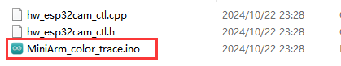

(2) In the library file **“hw_esp32cam_ctl.cpp”**, modify the register address of the color to be recognized to **“0x00”**. This address obtains the coordinate data of red.

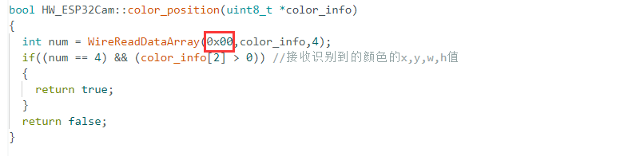

(3) Refer to the “[8.6.3 Program Download -> Arduino UNO Program Download]()” to flash the program into the development board. Once the flashing is completed, miniArm can track the red object.

### 8.6.7 **FAQ**

**Q**since the code was upload, the color can not be recognized.

**A:** please check that you have connected the 4-pin cable to the I2C interface and turn the knob on the expansion board to the initial position.

**Q:** why is the color recognized by the camera inaccurate or even incorrect?

**A:** please try to minimize the complexity of the background. You can use a single color or a simple environment as the background.

## 8.7 Face Detection

In this section, miniArm will use ESP32S3-Cam to recognize faces, then perform a waving gesture after a face is detected.

### 8.7.1 Program Flowchart


### 8.7.2 ESP32S3-Cam Development Board


ESP32S3-Cam development board integrates an ESP32 chip and a camera module. After being inserted into the expansion board, it uses the I2C communication interface to read color and face data through I2C communication.

* **Wiring**

Align the pins of ESP32S3-Cam with the pin headers on the camera expansion board, and connect it to an I2C interface on the miniArm expansion board with a 4PIN wire.


### 8.7.3 Program Download

:::{Note}

- Remove the Bluetooth module before downloading the program. Or the program will fail to download because of the serial port conflict.

- Please switch the battery box to the “OFF” when connecting the Type-B download cable. This action prevents the download cable from accidentally touching the power pins of the expansion board, which may cause a short circuit.

:::

* **Arduino UNO Program Download**

[MiniArm_face_hello]()

(1) Locate and open the **“MiniArm_face_hello\MiniArm_face_hello.ino”** program file in the same directory as this section.


(2) Connect Arduino to the computer with the UNO cable (Type-B).


(1) Click **“Select Development Board”**, and the software will automatically detect the current Arduino serial port. Next, click to connect.


(2) Click  to download the program into Arduino. Then just wait for it to complete.


* **ESP32S3-Cam Firmware Flashing**

[Face Detection]()

(1) Connect the ESP32S3-Cam to the computer with a Type-C data cable.

(2) Locate and open the **“ESP32S3-Cam Face Detection Program\ FaceDetection\FaceDetection.ino”** program file in the same directory as this section.


(3) Select the **“ESP32S3 Dev Module”** development board.


(4) Click the **“Tool”** in the menu bar, and select the corresponding configuration for the ESP32S3 development board.


(5) Click to download the program to the ESP32S3-Cam, and then wait for the download to complete.


### 8.7.4 Program Outcome

(1) After being powered on, the robotic arm returns to the neutral position, and the RGB light on the expansion board lights up blue.

(2) When a face is detected, the robotic gripper opens and closes, making a waving action.

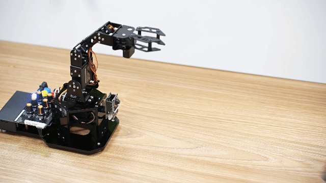

### 8.7.5 Brief Program Analysis

* **Import Library File**

(1) Import the required libraries for RGB control, servo control, and the ESP32Cam communication library files for the game.

{lineno-start=7}

```
#include <FastLED.h> //导入LED库
#include <Servo.h> //导入舵机库
#include "hw_esp32cam_ctl.h" //导入ESP32Cam通讯库
```

* **Define Pin and Create Object**

(1) Firstly, define Arduino pins used for connecting hardware, mainly consisting of five servo pins, one buzzer pin and one RGB light pin.

{lineno-start=12}

```
const static uint8_t servoPins[5] = { 7, 6, 5, 4, 3 };
const static uint8_t buzzerPin = 11;
const static uint8_t rgbPin = 13;
```

(2) Then, define the variables for RGB light control, ESP32Cam communication, and servos. The array `extended_func_angles` is used to store each servo’s desired angle. The `limt_angles` array is used to limit the servo’s rotation angle. The `servo_angles` array is used to store each servo’s actual angle.

{lineno-start=16}

```
//RGB light control object
static CRGB rgbs[1];
//ESP32Cam communication object
HW_ESP32Cam hw_cam;
//servo control object
Servo servos[5];

/* the used angle values of secondary development example */
static uint8_t extended_func_angles[5] = { 90, 140, 140, 87, 88 }; 
/* limit of each joint’s angle */
const uint8_t limt_angles[5][2] = {{0,92},{0,180},{0,180},{25,180},{0,180} }; 
/* Actual angle values of servo control */
static uint8_t servo_angles[5] = { 90, 140, 140, 87, 88 };
```

Regarding the desired and actual values, differences may arise between them during the servo rotation control process due to various factors. You can inspect the “servo_control” function called within the main “loop” function for further details.

If you want the servo to gradually move towards the target position, you need to call `servo_angles[i] = servo_angles[i] * 0.8 + extended _func_ a ngles[i] * 0.2` in the control task function.

This allows the servo to move each time at 80% of the actual value and 20% of the expected value, so that the actual value will gradually approach the expected value. And when it is equal to the expected value, the robotic arm stops moving.

{lineno-start=151}

```
void servo_control(void) {
  static uint32_t last_tick = 0;
  if (millis() - last_tick < 20) {
    return;
  }
  last_tick = millis();

  for (int i = 0; i < 5; ++i) {
    if(servo_angles[i] > extended_func_angles[i])
    {
      servo_angles[i] = servo_angles[i] * 0.8 + extended_func_angles[i] * 0.2;
      if(servo_angles[i] < extended_func_angles[i])
        servo_angles[i] = extended_func_angles[i];
    }else if(servo_angles[i] < extended_func_angles[i])
    {
      servo_angles[i] = servo_angles[i] * 0.8 + (extended_func_angles[i] * 0.2 + 1);
      if(servo_angles[i] > extended_func_angles[i])
        servo_angles[i] = extended_func_angles[i];
    }
    servo_angles[i] = servo_angles[i] < limt_angles[i][0] ? limt_angles[i][0] : servo_angles[i];
    servo_angles[i] = servo_angles[i] > limt_angles[i][1] ? limt_angles[i][1] : servo_angles[i];
    servos[i].write(i == 0 || i == 5 ? 180 - servo_angles[i] : servo_angles[i]);
  }
}
```

* **Initialization**

(1) The `setup ()` function mainly initializes associated hardware devices. Starting with the serial port, which sets the baud rate as **“115200”** and a read timeout as 500ms.

{lineno-start=33}

```
void setup() {
  // put your setup code here, to run once:
  Serial.begin(115200);
  // 设置串行端口读取数据的超时时间(set timeout for serial port reading data)
  Serial.setTimeout(500);
```

(2) Assign the servo IO port to facilitate the control through the pin.

{lineno-start=40}

```
  for (int i = 0; i < 5; ++i) {
    servos[i].attach(servoPins[i]);
  }
```

(3) Initialize the communication connector of ESP32S3-Cam and set the fill light brightness to 0. Within the range of 0 to 255. If it is 0, close the fill light.

{lineno-start=44}

```
 hw_cam.begin(); //初始化与ESP32Cam通讯接口(initialize ESP32S3-Cam communication interface)
```

(4) Use the `FastLED` library to initialize the RGB lights on the expansion board, and connect them to the RGB pins. Then set the color to blue by `rgbs[0] = CRGB(0, 0, 100)` and use the `FastLED.show` function to display the set color.

{lineno-start=47}

```
  FastLED.addLeds<WS2812, rgbPin, GRB>(rgbs, 1);
  rgbs[0] = CRGB(0, 0, 100);
  FastLED.show();
```

(5) Set the pin of the buzzer to output mode and stop activating the buzzer after a short sound.

{lineno-start=52}

```
  pinMode(buzzerPin, OUTPUT);
  tone(buzzerPin, 1000);
  delay(100);
  noTone(buzzerPin);
```

(4) Output the **“Start"** string through a serial port to indicate that the sensor is ready to start transmitting data.

{lineno-start=57}

```
  delay(2000);
  Serial.println("start");
```

* **Call Subfunction in a Loop**

After finishing the initialization, it enters the `loop` main function. First, call the `espcam_task` function which is used to detect face identification and perform the waving action. Then, call the `servo_control` function to control servos.

{lineno-start=62}

```
void loop() {
  // esp32cam通讯任务(ESP32S3-Cam communication task)
  espcam_task();
  // 舵机控制任务(servo control task)
  servo_control();
}
```

* **ESP32S3-Cam Communication Task**

Define the `espcam_task` function to detect face recognition and perform the waving action.

(1) Firstly, define 3 variables: `last_tick` records the timestamp of the last task execution; `step` tracks the current stage of task execution; and `delay_ count` sets the counting unit for time delay.

{lineno-start=71}

```
void espcam_task(void)
{
  static uint32_t last_tick = 0;
  static uint8_t step = 0;
  static uint32_t delay_count = 0;
```

(2) The `last_tick` variable and `millis()` are used for delay operation. Use the `millis()` function to obtain the running time of the program minus the `last_tick` variable. If the difference is less than 100, the function will return. If the difference is greater than or equal to 100, it means the task has been delayed by 50ms. Then the current time is assigned to the `last_tick` variable for the next delay.

{lineno-start=78}

```
  if (millis() - last_tick < 50) {
    return;
  }
  last_tick = millis();
```

(3) Assign the `rt` variable to the detection result.

{lineno-start=84}

```
  bool rt = hw_cam.faceDetect();
```

(3) Execute the waving action as soon as the face is detected. Stay stationary if the face is undetected. Here is the analysis of the `switch` code snippet:

{lineno-start=86}

```
  switch(step)
  {
    case 0:
      if(rt) //If a face is detected
      {
        delay_count = 0;
        rgbs[0].r = 0;
        rgbs[0].g = 100;
        rgbs[0].b = 0;
        FastLED.show();
```

**Case 0:** detect face according to the `hw_cam.colorDetect()`. If a face is detected, illuminate the RGB light in red and proceed to the next state.

{lineno-start=88}

```
    case 0:
      if(rt) //If a face is detected
      {
        delay_count = 0;
        rgbs[0].r = 0;
        rgbs[0].g = 100;
        rgbs[0].b = 0;
        FastLED.show();
        // adjust to the next step
        step++;
      }
      break;
```

**Case 1:** use `extended_func_angles` to control the open of the robotic gripper and set ID1 servo angle to 82°. Wait for 300ms to enter the next state.

{lineno-start=100}

```
    case 1: //open the gripper
      extended_func_angles[0] = 40;
      // wait for action completion
      delay_count++;
      if(delay_count > 6)
      {
        delay_count = 0;
        step++;
      }
      break;
```

**Case 2:** close the robotic gripper and set ID1 servo angle to 82°. Wait for 300ms to enter the next state.

{lineno-start=110}

```
    case 2: //close the gripper
      extended_func_angles[0] = 82;
      // wait for action completion
      delay_count++;
      if(delay_count > 6)
      {
        delay_count = 0;
        step++;
      }
      break;
```

Case 3 and case 4 are the same as above.

{lineno-start=120}

```
    case 3: //open the gripper
      extended_func_angles[0] = 40;
      // wait for action completion
      delay_count++;
      if(delay_count > 6)
      {
        delay_count = 0;
        step++;
      }
      break;
    case 4: //close the gripper
      extended_func_angles[0] = 82;
      // wait for action completion
      delay_count++;
      if(delay_count > 10)
      {
        rgbs[0].r = 0;
        rgbs[0].g = 0;
        rgbs[0].b = 100;
        FastLED.show();
        delay_count = 0;
        step++;
      }
      break;
```

After the action execution is completed, set the state value to 0 to restart the detecting.

{lineno-start=144}

```
    default:
      step = 0;
      break;
  }
}
```

* **Servo Control Task**

According to the target angle in the `extended_func_angles` array, the current angle in the “servo_angles” array, and each servo’s angle limit range, calculate and set each servo’s angle.

{lineno-start=151}

```
void servo_control(void) {
  static uint32_t last_tick = 0;
  if (millis() - last_tick < 20) {
    return;
  }
  last_tick = millis();

  for (int i = 0; i < 5; ++i) {
    if(servo_angles[i] > extended_func_angles[i])
```

(1) Firstly, check the time interval since the last execution. If the interval is less than 20ms, the function will return immediately to avoid updating the servo angle too frequently.

{lineno-start=151}

```
void servo_control(void) {
  static uint32_t last_tick = 0;
  if (millis() - last_tick < 20) {
    return;
  }
  last_tick = millis();
```

(2) By checking the difference between the `servo_angles[i]` (current servo angles) and the `extended_func_angles[i]` (target angles), adjust the servos’ rotation angles smoothly.

{lineno-start=158}

```
  for (int i = 0; i < 5; ++i) {
    if(servo_angles[i] > extended_func_angles[i])
    {
      servo_angles[i] = servo_angles[i] * 0.8 + extended_func_angles[i] * 0.2;
      if(servo_angles[i] < extended_func_angles[i])
        servo_angles[i] = extended_func_angles[i];
    }else if(servo_angles[i] < extended_func_angles[i])
    {
      servo_angles[i] = servo_angles[i] * 0.8 + (extended_func_angles[i] * 0.2 + 1);
      if(servo_angles[i] > extended_func_angles[i])
        servo_angles[i] = extended_func_angles[i];
    }
```

Check if the current servo angles are greater than the target angles. If they are, smoothly adjust the angles by taking small steps toward the target angles (each step is 80% of the current angles plus 20% of the target angles).

{lineno-start=158}

```
  for (int i = 0; i < 5; ++i) {
    if(servo_angles[i] > extended_func_angles[i])
    {
      servo_angles[i] = servo_angles[i] * 0.8 + extended_func_angles[i] * 0.2;
```

If the current servo angles are still greater than the target angles, directly set them to the target angles.

{lineno-start=162}

```
      if(servo_angles[i] < extended_func_angles[i])
        servo_angles[i] = extended_func_angles[i];
```

Check if the current servo angles are less than the target angles. If they are, smoothly adjust the angles by taking small steps toward the target angles (each step is 80% of the current angles plus 20% of the target angles plus 1).

{lineno-start=164}

```
    }else if(servo_angles[i] < extended_func_angles[i])
    {
      servo_angles[i] = servo_angles[i] * 0.8 + (extended_func_angles[i] * 0.2 + 1);
```

If the current servo angles are still less than the target angles, directly set them to the target angles.

{lineno-start=167}

```
      if(servo_angles[i] > extended_func_angles[i])
        servo_angles[i] = extended_func_angles[i];
    }
```

(3) After adjusting the angles, make sure that the current angles of the servo do not exceed its physical limits.

{lineno-start=170}

```
    servo_angles[i] = servo_angles[i] < limt_angles[i][0] ? limt_angles[i][0] : servo_angles[i];
    servo_angles[i] = servo_angles[i] > limt_angles[i][1] ? limt_angles[i][1] : servo_angles[i];
```

(4) Write the calculated angles into the servo.

{lineno-start=172}

```
    servos[i].write(i == 0 || i == 5 ? 180 - servo_angles[i] : servo_angles[i]);
  }
}
```

The method `servos[i].write()` is used to set the servo angles. It takes an angle value as a parameter and determines whether to invert it based on the value of “i”.

### 8.7.6 FAQ

**Q:** After the code is uploaded, the face cannot be recognized. What should I do?

**A:** Please check if the 4PIN wire is correctly connected to the I2C interface.

**Q:** Why the camera cannot recognize when I face it, but it can recognize when flipped upside down?

**A:** Please flash another bin file to enable recognition when facing forward.

