# 9. Serial Communication Instruction

## 9.1 Master-Slave Devices Communication Principle

### 9.1.1 Introduction

This section aims to introduce you to detailed information about the master-slave relationship between the miniArm robotic arm and different devices (such as Arduino, PC) during communication. It helps you understand how miniArm communicates as a subordinate device with other devices and how other devices control miniArm as a master device.

In this chapter, miniArm is typically utilized as a subordinate device. It uses the UART serial port to transmit the information to other devices.

### 9.1.2 Master-Slave Relationship

In a master-slave control system, miniArm acts as a subordinate device and other devices such as microcontrollers act as master devices.

* **miniArm Functions**

(1) Receive and parse signals sent by the master device:

The miniArm waits for serial signals. If data is received through the serial port, it will parse the received data based on the communication protocol to call the corresponding function.

(2) Call miniArm's functions based on received data:

When a signal is parsed, the corresponding function of miniArm needs to be called, such as controlling the servo movement, reading the servo angle, controlling the buzzer, and controlling the RGB lights.

(3) Data encapsulation and feedback:

When a read command is received, miniArm needs to call the corresponding read function. Encapsulate the read data into a data packet according to the communication protocol, and send it back to the master device.

* **Master Devices**

(1) Command packing and sending:

The master device needs to package control commands and data into data packets according to the communication protocol to sends them to miniArm.

(2) Control coordination:

The master is responsible for coordinating the entire system, ensuring there are no conflicts in communication and operation between miniArm and other devices to maintain a stable working state.

(3) Data reception:

The master sends a read command to read the servo status information data sent by miniArm. It verifies the integrity and accuracy of the received data and parses the data packet for extracting useful information.

* **Hardware Connection**

Take miniArm connected to a PC as an example:

(1) Use DuPont wires to respectively connect the RXD, TXD, and GND of the USB adapter to the IO12, IO10, and GND interfaces on the Arduino UNO.

Connect the USB adaptor to the PC.


* **Data Transmission Format**

The default UART serial data transmission Format of miniArm is as follows:

| Baud rate | 9600 |
| :-------: | :--: |
| Data bits |  8   |
|  Parity   | None |
| Stop bits |  1   |

* **Communication Protocol**

|  Header   | Function Code | Data Length | Data Information | Parity |
| :-------: | :-----------: | :---------: | :--------------: | :----: |
| 0xAA 0x77 |     func      |     len     |       data       | check  |

Header: When the header is received, it indicates the presence of data transmission, and the header data length is fixed at 2 bytes;  

Function Code: It indicates the function of an information frame;  

Data Length: It indicates the amount of data that follows;  

Data Information: It indicates the transmitted data information;  

Parity: (Function Code + Data Length + Data) negated, and the low byte is taken.

:::{Note}

* The host device and the miniArm can have different power sources, but they must share a common ground when connected to ensure stable communication voltage levels.

* When you wire the devices, ensure that the TX and RX pins of the UART serial port are crossed, otherwise communication will not be possible.

:::

## 9.2 PC Serial Port Control

This article demonstrates how to control the servo angles, buzzer, RGB lights, and read servo angles of the miniArm using the PC serial.

### 9.2.1 Working Principle

(1) By connecting miniArm to TTL serial and interfacing it with a PC, serial communication is established to control miniArm through the serial port.

(2) Communication Protocol:

There are some examples of communication protocols. The protocol instruction format is as follows:

| Frame Header | Function code | Data length | Data information | Parity |
| :----------: | :-----------: | :---------: | :--------------: | :----: |
|  0xAA 0x66   |     func      |     len     |       data       | check  |

Header: When the header is received, it indicates the presence of data transmission, and the header data length is fixed at 2 bytes;  

Function Code: It indicates the function of an information frame;  

Data Length: It indicates the amount of data that follows;  

Data Information: It indicates the transmitted data information;  

Parity: (Function Code + Data Length + Data) negated, and the low byte is taken.

### 9.2.2 Getting Ready

* **Hardware**

Make sure that the miniArm is properly connected to the PC. Otherwise, it will not communicate properly.

(1) Use DuPont wires to respectively connect the RXD, TXD, and GND of the USB adapter to the IO12, IO10, and GND interfaces on the Arduino UNO.

Connect the USB adaptor to the PC.

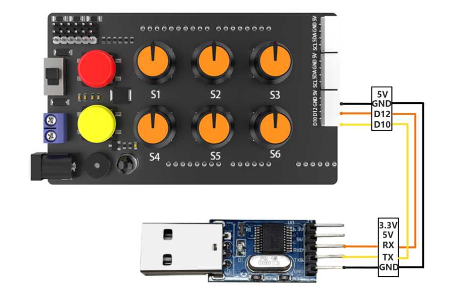

* **Software**

Make sure the baud is set to 9600, parity to NONE, data bits to 8 and the stop bits to 1 in the serial port utility. Then tick the "**hex**" to send. The configuration is shown below:


### 9.2.3 Program Outcome

Control the miniArm by sending hexadecimal commands.

(1) Command name: `FUNC_SET_SERVO` command value is 0x01, data length is 5:

Instruction: control servo rotation of the miniArm. The rotation angle is 0 to180 degrees.

Data information: five angles required to be set by servo, a total of five values. Each value corresponds to a servo, with a byte to indicate the required rotation angle.

Take sending the hexadecimal sequence **"AA 66 01 05 49 16 A1 39 5A 66"** as an example. In this sequence, the data information is **"49 16 A1 39 5A"**, where 49 means the servo NO.1 rotating to 73 degrees, 16 means the servo NO.2 rotating to 22 degrees, A1 means the servo NO.3 rotating to 161 degrees, 39 means the servo NO.4 rotating to 57 degrees, and 5A means the servo NO.5 rotating to 90 degrees.

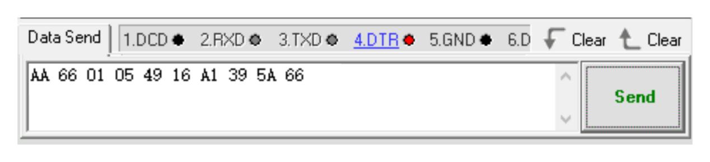

(2) Command name: `FUNC_SET_BUZZER` command value is 0x02, data length is 4:

Instruction: control miniArm's buzzer, frequency, time range from 0 to 65535.

Data information: first is the buzzer frequency, followed by running time, a total of 4 values. Each value is broken down into 2 bytes, with the low byte first and high byte second.

For example, let's take hexadecimal sequence **"AA 66 02 04 14 02 E8 03 F8"**. In this sequence, the data information is **"14 02 E8 03"**. Here the 14 02 represents setting the buzzer frequency to 532, and the E8 03 means the running time is 1000ms.

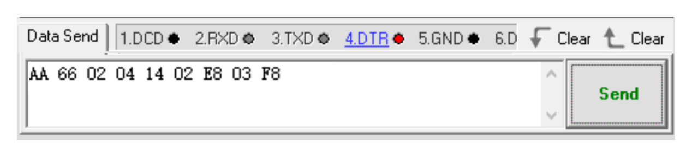

(3) Command name: `FUNC_SET_RGB` command value is 0x03, data length is 3:

Instruction: control the color of the RGB light, where the value range is from 0 to 255.

Data information: there are three parameters in total, representing the R(red), G(green), B(blue) colors in RGB respectively.

For example, let's take hexadecimal sequence **"AA 66 03 03 FF 00 00 FA"**. In this sequence, the data information is "**FF 00 00**". Here, FF represents setting the red color to 255, while the following two 00s means setting the green and blue colors to 0, respectively.

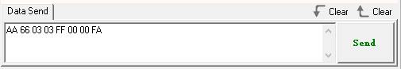

(4) Command name: `FUNC_READ_ANGLE` command value is 0x11, data length is 0.

Instruction: read the current miniArm servo angle.

Data information: no data message available since the read operation.

For example, let's take hexadecimal sequence **"AA 66 11 00 EE"**.

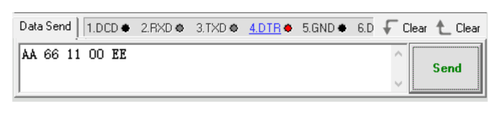

The miniArm returns to the current five servo angles respectively after sending the data. Take received data **"AA 66 11 05 5A 5A 5A 5A 5A 27"** as an example. The data message is **"5A 5A 5A 5A 5A"**, where the 1st to 5th 5A each means the current angle of the 1st to 5th servo is 90 degrees.

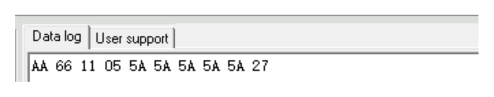

## 9.3 Arduino Control Example 

This section aims to guide you on how to use the PC serial port to control MiniArm's servo angles, buzzer, and RGB lights, as well as how to use it to read servo angles.

<p id="anchor_9_3_1"></p>

### 9.3.1 Working Principle

[MiniArm Slave Program](../_static/source_code/MiniArm_arduino.zip)

[Arduino Serial Port Control](../_static/source_code/arduino_and_MiniArm.zip)

The source code of the program is located at: "[**Serial Communication Instruction/arduino_and_MiniArm/arduino_and_MiniArm.ino**](../_static/source_code/arduino_and_MiniArm.zip)". For specific implementation details, please access the file: "[**Serial Communication Instruction/arduino_and_MiniArm/MiniArm_ctl.cpp**](../_static/source_code/arduino_and_MiniArm.zip)".

(1) Set the baud rate of debugging and printing serial port as 115200, and call the `mi_ctl.serial_begin()` function in the `MiniArm_ctl.h`library to initialize the software serial port for communication with a baud rate of 9600.

{lineno-start=5}

```
void setup() {
  Serial.begin(115200);
  mi_ctl.serial_begin();
}
```

(2) Call the `mi_ctl.set_angles()` function to control the servo angles. Take the `mi_ctl.set_angles(angles)` code as an example. The first parameter `angles` represents each servo's rotating angle. This parameter is a one-dimensional array with a length of 5 corresponding to 5 servos' required rotation angles respectively, with a rotation range from 0°to 180°.

{lineno-start=11}

```
  //set servos' angles
  Serial.println("set angles");
  uint8_t angles[5] = {73,10,161,57,90};
  /* set respectively the bus servos' angles to 73/10/0/57/90/180 digresses, 
    ranging from 0-180 */
  mi_ctl.set_angles(angles); 
  delay(1500);
```

(3) Call the `mi_ctl.set_buzzer()` function to set the buzzer. Take the `mi_ctl.set_buzzer(532, 1000)` code as an example. The first parameter `532` indicates the buzzer frequency to be set ranging from 0 to 65535. The second parameter `1000` represents the running time (in ms) which is 1000ms.

{lineno-start=19}

```
  //set buzzer
  Serial.println("set buzzer");
  //set the buzzer frequency to 532 and the runtime to 1000 ms
  //the ranges of these two parameters are both 0-65535
  mi_ctl.set_buzzer(532,1000);
  delay(1500);
```

(4) Call the `mi_ctl.set_rgb()` function to control the color of RGB light. Take the `mi_ctl.set_rgb(rgb)` code as an example. The parameter `rgb` is a one-dimensional array with a length of three, corresponding to red, green, and blue respectively, and ranging from 0 to 255.

{lineno-start=26}

```
  //set RGB light
  Serial.println("set rgb");
  uint8_t rgb[3] = {0,255,0}; 
  //set RGB light to green (ranging from 0 to 255)
  mi_ctl.set_rgb(rgb);
  delay(1500);
```

(5) Call the `mi_ctl.read_angles()` function to obtain the angle information of 5 servos of MiniArm. The read servo angles can be saved in the `read_a` array and printed via the serial port.

{lineno-start=}

```
  //read and print the servo angle of current status
  Serial.println("read angles");
  uint8_t read_a[5] = {0,0,0,0,0};
  if(mi_ctl.read_angles(read_a))
  {
    Serial.print("angles: ");
    for(int i=0;i<5;i++){
      Serial.print(read_a[i]);
      Serial.print(" ");
    }
  }
  delay(100);
```

### 9.3.2 Getting Ready

* **Hardware**

The interface for MiniArm serial communication is a 4-pin. It is suitable for devices with pin interfaces for UART communication such as Arduino. Now you need to connect the MiniArm's 4-pin to its corresponding pin interfaces for communication.

The connection of the 4-pin interface communication is as follows:

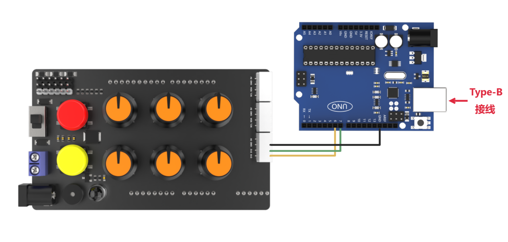

The detailed connection is as follows:

Connect the IO12 pin of MiniArm used as the TX signal pin to the No.6 pin of Arduino.

Connect the IO10 pin of MiniArm used as the RX signal pin to the No.7 pin of Arduino.

Connect the GND pins of MiniArm and Arduino.

* **Software**

Please refer to the instructions in "[**2. Set Arduino Environment**](https://docs.hiwonder.com/projects/miniArm/en/latest/docs/2.Set_Arduino_Environment.html)" to establish the connection between MiniArm and Arduino editor.

### 9.3.3 Program Download

(1) Double-click  to open it.


(2) Click **"File -\> Open"**.

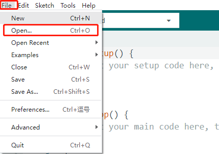

(3) Open the source code path in "[**9.3.1 Working Principle**](#anchor_9_3_1)" to click **"Open"**.

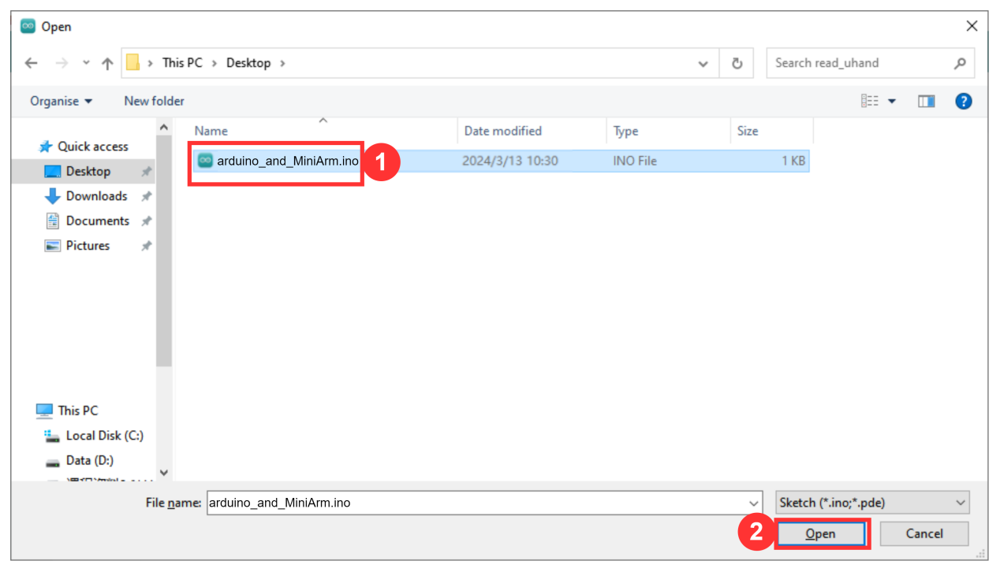

(4) Click **"Tools -\> Development Board"** to select **"Arduino UNO"**. Take COM10 as an example. (If you have already configured the development board model and port number during the setup of the development environment, please skip this step.)


(5) If you are unsure about the port number, please right-click **"This PC"** and click **"Properties -\> Device Manager"** to view the port number corresponding to the master (the device with CH340). Once you have found it, you can reselect it in the Arduino.

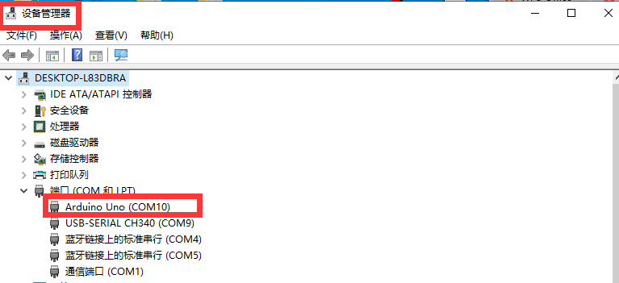

(6) After confirming that everything is correct, click  to verify the program. If the program is correct, the status area shows **"Compiling Project -&gt; Completed"** in turn. Then it displays the number of bytes used by the current project, the program storage space, and etc.

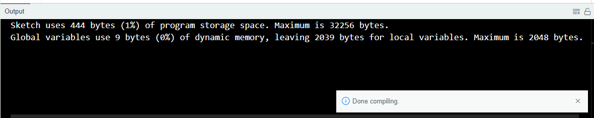

(7) After successful compilation, click  to upload the program to the development board. The status area shows **"Compiling Project -&gt; Uploading -&gt; Upload successfully"** in turn. After that, the status area stops printing and uploading information.


### 9.3.4  Program Outcome

When the program runs:

(1) Five servos respectively rotate to 73, 10, 161, 57, and 90 degrees.

(2) After 1.5 seconds, the buzzer of MiniArm sounds at 532hz for 1 second.

(3) Then, the color of the LED is set to green.

(4) Finally, the angles of MiniArm's 5 servos are printed on the serial monitor.